# **Hệ thống Thuyết minh Du lịch Tự động (Auto Audio Guide)**

# **Focused Use Cases**

# **Version 1.1**

# **Revision History**

| Date       | Version | Description                                                                        | Author     |
| ---------- | ------- | ---------------------------------------------------------------------------------- | ---------- |
| 29-09-2026 | 1.0     | Focused Use Cases, Use Case Diagram, Activity Diagrams, Business Rules, Risks      | Khang Pham |
| 29-09-2026 | 1.1     | Audio mặc định là audio tiếng Anh của từng POI; tách rõ quyền POI Manager và Admin | Khang Pham |

# **Table of Contents**

1. [Actors](#actors)
2. [Use Case Diagram tổng quát](#use-case-diagram-tổng-quát)
3. [UC01 — Automatic Audio Playback by Geofence](#uc01--automatic-audio-playback-by-geofence)
4. [UC02 — Scan QR Code to Play Audio](#uc02--scan-qr-code-to-play-audio)
5. [UC03 — Download and Use Offline Pack](#uc03--download-and-use-offline-pack)
6. [UC04 — Login Authentication](#uc04--login-authentication)
7. [UC05 — Manage POI Content](#uc05--manage-poi-content)
8. [UC06 — Manage Zone and Offline Pack](#uc06--manage-zone-and-offline-pack)
9. [UC07 — View Tourism Analytics and Heatmap](#uc07--view-tourism-analytics-and-heatmap)
10. [UC08 — Manage Dashboard Accounts](#uc08--manage-dashboard-accounts)
11. [Business Rules](#business-rules)
12. [Risks](#risks)
13. [Quy ước ký hiệu](#quy-ước-ký-hiệu)

---

# **Actors**

| Actor                            | Mô tả                                                                                                                                                                                                                                                                                      | Use Case chính                                           |
| -------------------------------- | ------------------------------------------------------------------------------------------------------------------------------------------------------------------------------------------------------------------------------------------------------------------------------------------ | -------------------------------------------------------- |
| **Anonymous Visitor (Du khách)** | Người dùng Mobile App, không cần tài khoản, được định danh bằng `anonymous_device_id`.                                                                                                                                                                                                     | UC01, UC02, UC03                                         |
| **POI Manager**                  | Người nắm toàn quyền quản lý tất cả POI, và **chỉ có quyền liên quan đến POI**: tạo/sửa/archive POI, nội dung, audio, QR; build Offline Pack từ các POI; xem Analytics của POI. Thay đổi có hiệu lực ngay, không cần chờ duyệt. Không được quản lý Zone, cấu hình hệ thống hoặc tài khoản. | UC04, UC05, UC06 (chỉ build pack), UC07                  |
| **Admin**                        | Quản trị viên hệ thống: có mọi quyền của POI Manager (can thiệp, chỉnh sửa trực tiếp POI), cộng thêm quản lý Zone (tạo, sửa, archive) và cấu hình hệ thống (bán kính geofence, cooldown, dwell time, chính sách đăng nhập).                                                                | UC04, UC05, UC06, UC07                                   |
| **Super Admin**                  | Có toàn bộ quyền của Admin, đồng thời quản lý tài khoản Dashboard và role. Bắt buộc xác thực MFA khi đăng nhập.                                                                                                                                                                            | UC04, UC07, UC08 (và UC05, UC06 qua kế thừa quyền Admin) |

Quan hệ kế thừa actor: **Super Admin → Admin → POI Manager**. Mỗi role cấp trên có toàn bộ quyền của role cấp dưới và thêm quyền riêng.

---

# **Use Case Diagram tổng quát**

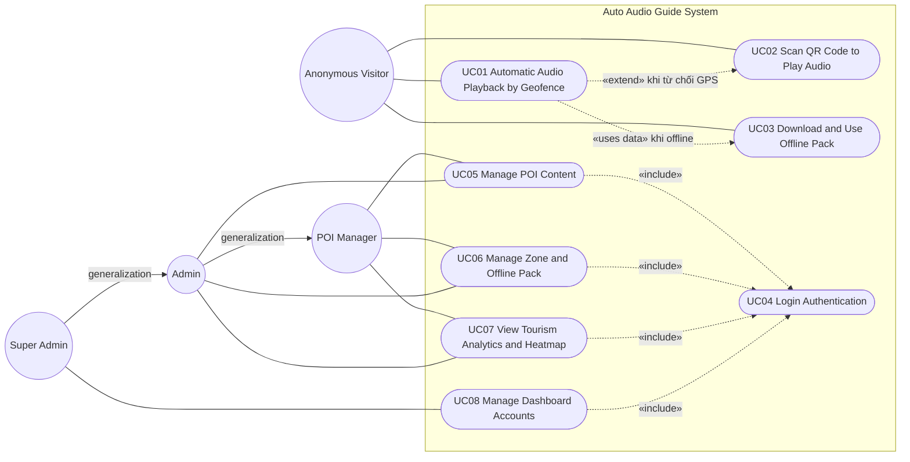

Ghi chú:

- `«include»`: UC05, UC06, UC07, UC08 luôn bắt đầu bằng **{Login Authentication}**.
- UC01 dùng dữ liệu của **{Download and Use Offline Pack}** khi thiết bị offline; khi du khách từ chối GPS, UC01 chuyển hướng sang **{Scan QR Code to Play Audio}**.
- Super Admin kế thừa toàn bộ quyền của Admin; Admin kế thừa toàn bộ quyền của POI Manager (generalization).

---

# **UC01 — Automatic Audio Playback by Geofence**

**Use Case Diagram (UC01):**

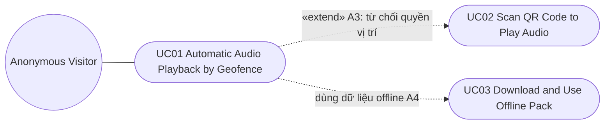

| **Use Case Number:**           | **UC01**                                                                                                                                                                                                                                                                                                                                                                                                                                                                                                                                        |                                                                                                                                                                                                                                               |
| :----------------------------- | :---------------------------------------------------------------------------------------------------------------------------------------------------------------------------------------------------------------------------------------------------------------------------------------------------------------------------------------------------------------------------------------------------------------------------------------------------------------------------------------------------------------------------------------------- | :-------------------------------------------------------------------------------------------------------------------------------------------------------------------------------------------------------------------------------------------- |
| **Use Case Name:**             | Automatic Audio Playback by Geofence                                                                                                                                                                                                                                                                                                                                                                                                                                                                                                            |                                                                                                                                                                                                                                               |
| **Actor (s):**                 | Anonymous Visitor (Du khách)                                                                                                                                                                                                                                                                                                                                                                                                                                                                                                                    |                                                                                                                                                                                                                                               |
| **Maturity:**                  | Focused                                                                                                                                                                                                                                                                                                                                                                                                                                                                                                                                         |                                                                                                                                                                                                                                               |
| **Summary:**                   | Du khách sử dụng Mobile App để tự động nghe bài thuyết minh theo ngôn ngữ đã chọn khi đi vào vùng geofence của một POI. Hệ thống xác nhận vị trí ổn định (debounce 3 giây), chọn đúng POI khi các vùng chồng lấp, chống phát lặp bằng cooldown 5 phút, chọn nguồn audio phù hợp (có sẵn → tạo mới → audio mặc định là bản tiếng Anh của chính POI đó), tự dừng audio cũ khi du khách rời POI hoặc ở đủ lâu trong POI khác, và ghi nhận lượt nghe ẩn danh để phục vụ Analytics. Chức năng hoạt động được cả khi offline nếu đã tải Offline Pack. |                                                                                                                                                                                                                                               |
| **Basic Course of Events:**    | **Actor Action**                                                                                                                                                                                                                                                                                                                                                                                                                                                                                                                                | **System Response**                                                                                                                                                                                                                           |
|                                | 1\. Du khách mở Mobile App.                                                                                                                                                                                                                                                                                                                                                                                                                                                                                                                     |                                                                                                                                                                                                                                               |
|                                |                                                                                                                                                                                                                                                                                                                                                                                                                                                                                                                                                 | 2\. Hệ thống đọc `anonymous_device_id` trong Secure Local Storage; nếu chưa có, hệ thống tạo UUID ngẫu nhiên và lưu lại. **E1**                                                                                                               |
|                                |                                                                                                                                                                                                                                                                                                                                                                                                                                                                                                                                                 | 3\. Hệ thống kiểm tra ngôn ngữ đã lưu. Ở lần mở đầu tiên, hệ thống hiển thị màn hình chọn ngôn ngữ, trong đó **English** được chọn sẵn. **A1**                                                                                                |
|                                | 4\. Du khách chọn ngôn ngữ thuyết minh và xác nhận.                                                                                                                                                                                                                                                                                                                                                                                                                                                                                             |                                                                                                                                                                                                                                               |
|                                |                                                                                                                                                                                                                                                                                                                                                                                                                                                                                                                                                 | 5\. Hệ thống lưu ngôn ngữ và kiểm tra trạng thái **Auto-play** (mặc định: bật). **A2**                                                                                                                                                        |
|                                |                                                                                                                                                                                                                                                                                                                                                                                                                                                                                                                                                 | 6\. Hệ thống yêu cầu quyền truy cập vị trí (bao gồm vị trí nền).                                                                                                                                                                              |
|                                | 7\. Du khách cấp quyền vị trí. **A3**                                                                                                                                                                                                                                                                                                                                                                                                                                                                                                           |                                                                                                                                                                                                                                               |
|                                |                                                                                                                                                                                                                                                                                                                                                                                                                                                                                                                                                 | 8\. Hệ thống kiểm tra kết nối mạng và thực hiện Delta Sync để tải thay đổi mới nhất của POI, nội dung đa ngôn ngữ, audio metadata và cấu hình geofence. **A4, E2**                                                                            |
|                                |                                                                                                                                                                                                                                                                                                                                                                                                                                                                                                                                                 | 9\. Hệ thống nạp các POI gần vị trí hiện tại vào Hotset và đăng ký Background Geofence với bán kính cấu hình hiện hành (mặc định 30 m). **E3**                                                                                                |
|                                | 10\. Du khách di chuyển vào vùng geofence của một POI.                                                                                                                                                                                                                                                                                                                                                                                                                                                                                          |                                                                                                                                                                                                                                               |
|                                |                                                                                                                                                                                                                                                                                                                                                                                                                                                                                                                                                 | 11\. Hệ thống nhận geofence entry event, chờ 3 giây debounce và xác nhận thiết bị vẫn nằm trong vùng với độ chính xác GPS chấp nhận được. **E4**                                                                                              |
|                                |                                                                                                                                                                                                                                                                                                                                                                                                                                                                                                                                                 | 12\. Hệ thống xác định POI mục tiêu. Nếu thiết bị nằm trong nhiều geofence chồng lấp, hệ thống áp dụng quy tắc chọn POI (BR-06). **A5**                                                                                                       |
|                                |                                                                                                                                                                                                                                                                                                                                                                                                                                                                                                                                                 | 13\. Hệ thống kiểm tra cooldown 5 phút của cặp `device_id` và `poi_id` đối với trigger geofence. **A6**                                                                                                                                       |
|                                |                                                                                                                                                                                                                                                                                                                                                                                                                                                                                                                                                 | 14\. Hệ thống kiểm tra có audio của POI khác đang phát hay không. **A7**                                                                                                                                                                      |
|                                |                                                                                                                                                                                                                                                                                                                                                                                                                                                                                                                                                 | 15\. Hệ thống chọn nguồn audio theo ngôn ngữ đã chọn theo thứ tự: audio trong Offline Pack/local → audio cloud đã cache → tạo audio mới bằng Cloud TTS → audio mặc định (audio tiếng Anh của POI). **E5, E8**                                 |
|                                |                                                                                                                                                                                                                                                                                                                                                                                                                                                                                                                                                 | 16\. Hệ thống tự động phát audio qua loa hoặc tai nghe, kể cả khi màn hình đang khóa nếu hệ điều hành cho phép. **E6**                                                                                                                        |
|                                |                                                                                                                                                                                                                                                                                                                                                                                                                                                                                                                                                 | 17\. Hệ thống ghi `audio_play_event` gồm `anonymous_device_id`, `poi_id`, ngôn ngữ, `trigger_type = geofence`, nguồn audio, thời điểm bắt đầu, thời lượng nghe; đồng bộ lên Backend nếu có mạng, hoặc lưu vào local queue nếu offline. **E7** |
|                                | 18\. Du khách nghe thuyết minh và tiếp tục tham quan. **A8, A9**                                                                                                                                                                                                                                                                                                                                                                                                                                                                                |                                                                                                                                                                                                                                               |
|                                |                                                                                                                                                                                                                                                                                                                                                                                                                                                                                                                                                 | 19\. Hệ thống quay lại bước 10 để theo dõi POI tiếp theo. Use case kết thúc khi du khách đóng ứng dụng hoặc tắt Auto-play.                                                                                                                    |
|                                |                                                                                                                                                                                                                                                                                                                                                                                                                                                                                                                                                 |                                                                                                                                                                                                                                               |
| **Alternative Paths:**         | **A1.** Du khách đã chọn ngôn ngữ ở lần mở trước.                                                                                                                                                                                                                                                                                                                                                                                                                                                                                               |                                                                                                                                                                                                                                               |
|                                | **Actor Action**                                                                                                                                                                                                                                                                                                                                                                                                                                                                                                                                | **System Response**                                                                                                                                                                                                                           |
|                                |                                                                                                                                                                                                                                                                                                                                                                                                                                                                                                                                                 | 1\. Hệ thống tải ngôn ngữ đã lưu, không hiển thị màn hình chọn ngôn ngữ.                                                                                                                                                                      |
|                                |                                                                                                                                                                                                                                                                                                                                                                                                                                                                                                                                                 | Return to step 5 of the Basic Course of Events.                                                                                                                                                                                               |
|                                | **A2.** Du khách đã tắt Auto-play.                                                                                                                                                                                                                                                                                                                                                                                                                                                                                                              |                                                                                                                                                                                                                                               |
|                                | **Actor Action**                                                                                                                                                                                                                                                                                                                                                                                                                                                                                                                                | **System Response**                                                                                                                                                                                                                           |
|                                |                                                                                                                                                                                                                                                                                                                                                                                                                                                                                                                                                 | 1\. Hệ thống không đăng ký trigger phát audio tự động theo geofence.                                                                                                                                                                          |
|                                |                                                                                                                                                                                                                                                                                                                                                                                                                                                                                                                                                 | 2\. Hệ thống hiển thị bản đồ POI; du khách vẫn có thể thực hiện **{Scan QR Code to Play Audio}**. The use case ends.                                                                                                                          |
|                                | **A3.** Du khách từ chối quyền vị trí.                                                                                                                                                                                                                                                                                                                                                                                                                                                                                                          |                                                                                                                                                                                                                                               |
|                                | **Actor Action**                                                                                                                                                                                                                                                                                                                                                                                                                                                                                                                                | **System Response**                                                                                                                                                                                                                           |
|                                | 1\. Du khách chọn “Không cho phép” khi hệ thống yêu cầu quyền vị trí.                                                                                                                                                                                                                                                                                                                                                                                                                                                                           |                                                                                                                                                                                                                                               |
|                                |                                                                                                                                                                                                                                                                                                                                                                                                                                                                                                                                                 | 2\. Hệ thống thông báo tính năng tự động phát cần quyền vị trí và hướng dẫn bật lại trong Settings của thiết bị.                                                                                                                              |
|                                |                                                                                                                                                                                                                                                                                                                                                                                                                                                                                                                                                 | 3\. Hệ thống đề xuất du khách thực hiện **{Scan QR Code to Play Audio}**. The use case ends.                                                                                                                                                  |
|                                | **A4.** Thiết bị không có kết nối mạng.                                                                                                                                                                                                                                                                                                                                                                                                                                                                                                         |                                                                                                                                                                                                                                               |
|                                | **Actor Action**                                                                                                                                                                                                                                                                                                                                                                                                                                                                                                                                | **System Response**                                                                                                                                                                                                                           |
|                                |                                                                                                                                                                                                                                                                                                                                                                                                                                                                                                                                                 | 1\. Hệ thống không kết nối được Backend trong thời gian probe tối đa (cấu hình hệ thống) và chuyển sang Offline Mode.                                                                                                                         |
|                                |                                                                                                                                                                                                                                                                                                                                                                                                                                                                                                                                                 | 2\. Hệ thống đọc POI, nội dung, audio và bản đồ từ Offline Pack đã cài qua **{Download and Use Offline Pack}**. **E2**                                                                                                                        |
|                                |                                                                                                                                                                                                                                                                                                                                                                                                                                                                                                                                                 | Return to step 9 of the Basic Course of Events.                                                                                                                                                                                               |
|                                | **A5.** Thiết bị nằm trong nhiều geofence chồng lấp.                                                                                                                                                                                                                                                                                                                                                                                                                                                                                            |                                                                                                                                                                                                                                               |
|                                | **Actor Action**                                                                                                                                                                                                                                                                                                                                                                                                                                                                                                                                | **System Response**                                                                                                                                                                                                                           |
|                                |                                                                                                                                                                                                                                                                                                                                                                                                                                                                                                                                                 | 1\. Hệ thống tính khoảng cách từ thiết bị đến tâm từng POI chồng lấp và chọn POI có khoảng cách nhỏ nhất (BR-06).                                                                                                                             |
|                                |                                                                                                                                                                                                                                                                                                                                                                                                                                                                                                                                                 | 2\. Nếu chênh lệch khoảng cách giữa hai POI gần nhất nhỏ hơn ngưỡng cấu hình (đề xuất 5 m), hệ thống chọn POI có `priority` cao hơn; nếu vẫn bằng nhau, chọn POI có `poi_id` nhỏ hơn để kết quả luôn ổn định.                                 |
|                                |                                                                                                                                                                                                                                                                                                                                                                                                                                                                                                                                                 | 3\. Hệ thống hiển thị banner “Gần đây còn có: …” để du khách có thể chủ động nghe POI còn lại.                                                                                                                                                |
|                                |                                                                                                                                                                                                                                                                                                                                                                                                                                                                                                                                                 | Return to step 13 of the Basic Course of Events.                                                                                                                                                                                              |
|                                | **A6.** POI đang trong thời gian cooldown.                                                                                                                                                                                                                                                                                                                                                                                                                                                                                                      |                                                                                                                                                                                                                                               |
|                                | **Actor Action**                                                                                                                                                                                                                                                                                                                                                                                                                                                                                                                                | **System Response**                                                                                                                                                                                                                           |
|                                |                                                                                                                                                                                                                                                                                                                                                                                                                                                                                                                                                 | 1\. Hệ thống xác định POI đã được phát bằng trigger geofence cho cùng thiết bị trong vòng 5 phút.                                                                                                                                             |
|                                |                                                                                                                                                                                                                                                                                                                                                                                                                                                                                                                                                 | 2\. Hệ thống bỏ qua event, không phát lại audio và không ghi thêm lượt nghe.                                                                                                                                                                  |
|                                |                                                                                                                                                                                                                                                                                                                                                                                                                                                                                                                                                 | Return to step 10 of the Basic Course of Events.                                                                                                                                                                                              |
|                                | **A7.** Audio của một POI khác đang phát.                                                                                                                                                                                                                                                                                                                                                                                                                                                                                                       |                                                                                                                                                                                                                                               |
|                                | **Actor Action**                                                                                                                                                                                                                                                                                                                                                                                                                                                                                                                                | **System Response**                                                                                                                                                                                                                           |
|                                |                                                                                                                                                                                                                                                                                                                                                                                                                                                                                                                                                 | 1\. Hệ thống không cắt ngang audio đang phát ngay lập tức.                                                                                                                                                                                    |
|                                |                                                                                                                                                                                                                                                                                                                                                                                                                                                                                                                                                 | 2\. Hệ thống theo dõi thời gian thiết bị ở trong POI mới (dwell time).                                                                                                                                                                        |
|                                |                                                                                                                                                                                                                                                                                                                                                                                                                                                                                                                                                 | 3\. Khi thiết bị ở trong POI mới đủ thời gian quy định (BR-08, đề xuất 10 giây), hệ thống fade-out và dừng audio cũ, ghi trạng thái `interrupted` cho event cũ.                                                                               |
|                                |                                                                                                                                                                                                                                                                                                                                                                                                                                                                                                                                                 | Return to step 15 of the Basic Course of Events.                                                                                                                                                                                              |
|                                |                                                                                                                                                                                                                                                                                                                                                                                                                                                                                                                                                 | 4\. Nếu thiết bị rời POI mới trước khi đủ thời gian, hệ thống giữ nguyên audio cũ. Return to step 10 of the Basic Course of Events.                                                                                                           |
|                                | **A8.** Du khách rời khỏi vùng POI đang phát.                                                                                                                                                                                                                                                                                                                                                                                                                                                                                                   |                                                                                                                                                                                                                                               |
|                                | **Actor Action**                                                                                                                                                                                                                                                                                                                                                                                                                                                                                                                                | **System Response**                                                                                                                                                                                                                           |
|                                | 1\. Du khách đi ra khỏi geofence của POI đang phát.                                                                                                                                                                                                                                                                                                                                                                                                                                                                                             |                                                                                                                                                                                                                                               |
|                                |                                                                                                                                                                                                                                                                                                                                                                                                                                                                                                                                                 | 2\. Hệ thống xác nhận geofence exit event sau thời gian debounce.                                                                                                                                                                             |
|                                |                                                                                                                                                                                                                                                                                                                                                                                                                                                                                                                                                 | 3\. Hệ thống fade-out và dừng audio, ghi trạng thái `stopped_on_exit` cùng thời lượng đã nghe.                                                                                                                                                |
|                                |                                                                                                                                                                                                                                                                                                                                                                                                                                                                                                                                                 | Return to step 10 of the Basic Course of Events.                                                                                                                                                                                              |
|                                | **A9.** Du khách thay đổi cài đặt trong lúc tham quan.                                                                                                                                                                                                                                                                                                                                                                                                                                                                                          |                                                                                                                                                                                                                                               |
|                                | **Actor Action**                                                                                                                                                                                                                                                                                                                                                                                                                                                                                                                                | **System Response**                                                                                                                                                                                                                           |
|                                | 1\. Du khách mở Settings và đổi ngôn ngữ, hoặc tắt/bật Auto-play, hoặc chọn Pause/Stop audio.                                                                                                                                                                                                                                                                                                                                                                                                                                                   |                                                                                                                                                                                                                                               |
|                                |                                                                                                                                                                                                                                                                                                                                                                                                                                                                                                                                                 | 2\. Nếu đổi ngôn ngữ, hệ thống áp dụng ngôn ngữ mới cho lần phát tiếp theo. Nếu tắt Auto-play, hệ thống hủy đăng ký trigger phát tự động và use case kết thúc. Nếu Pause/Stop, hệ thống dừng audio và ghi trạng thái tương ứng.               |
|                                |                                                                                                                                                                                                                                                                                                                                                                                                                                                                                                                                                 | Return to step 10 of the Basic Course of Events.                                                                                                                                                                                              |
| **Exception Paths:**           | **E1.** Hệ thống không thể ghi `anonymous_device_id` vào Secure Local Storage. Hệ thống tạo session ID tạm thời chỉ tồn tại trong phiên hiện tại, ghi log lỗi. Return to step 3 of the Basic Course of Events.                                                                                                                                                                                                                                                                                                                                  |                                                                                                                                                                                                                                               |
|                                | **E2.** Delta Sync thất bại (timeout, API error, dữ liệu không hợp lệ) hoặc thiết bị offline. Nếu có dữ liệu local hợp lệ, hệ thống thông báo “Dữ liệu có thể chưa được cập nhật” và tiếp tục tại step 9 of the Basic Course of Events. Nếu không có dữ liệu local, hệ thống thông báo “Cần kết nối Internet hoặc tải Offline Pack” và use case kết thúc.                                                                                                                                                                                       |                                                                                                                                                                                                                                               |
|                                | **E3.** Hệ điều hành từ chối đăng ký Background Geofence hoặc vượt giới hạn số vùng geofence. Hệ thống chỉ đăng ký các POI gần nhất trong giới hạn cho phép và cập nhật Hotset khi du khách di chuyển. Return to step 10 of the Basic Course of Events.                                                                                                                                                                                                                                                                                         |                                                                                                                                                                                                                                               |
|                                | **E4.** Độ chính xác GPS không đạt ngưỡng hoặc thiết bị rời vùng trong 3 giây debounce. Hệ thống hủy trigger hiện tại. Return to step 10 of the Basic Course of Events.                                                                                                                                                                                                                                                                                                                                                                         |                                                                                                                                                                                                                                               |
|                                | **E5.** Không có audio sẵn cho ngôn ngữ đã chọn và không thể tạo audio mới (offline, Cloud TTS lỗi, timeout hoặc hàng đợi TTS quá tải). Hệ thống phát **audio mặc định** là audio tiếng Anh của chính POI đó (BR-10), ghi `audio_source = default_en`. Return to step 16 of the Basic Course of Events.                                                                                                                                                                                                                                         |                                                                                                                                                                                                                                               |
|                                | **E6.** Audio Player không thể phát (file hỏng, codec không hỗ trợ, mất audio focus). Hệ thống thử phát lại 1 lần; nếu vẫn thất bại và ngôn ngữ đang chọn không phải English, hệ thống phát audio tiếng Anh của POI. Nếu audio tiếng Anh cũng thất bại, hệ thống hiển thị thông báo lỗi, ghi event lỗi. Return to step 10 of the Basic Course of Events.                                                                                                                                                                                        |                                                                                                                                                                                                                                               |
|                                | **E8.** Không có audio tiếng Anh của POI (chưa tạo xong hoặc bị lỗi) và cũng không thể tạo audio. Hệ thống hiển thị nội dung text của POI kèm thông báo “Audio chưa sẵn sàng”, ghi event lỗi. Return to step 10 of the Basic Course of Events.                                                                                                                                                                                                                                                                                                  |                                                                                                                                                                                                                                               |
|                                | **E7.** Không thể đồng bộ event lên Backend. Hệ thống giữ event trong local queue, tăng `retry_count` và thử lại ở lần có mạng kế tiếp. Return to step 18 of the Basic Course of Events.                                                                                                                                                                                                                                                                                                                                                        |                                                                                                                                                                                                                                               |
| **Extension Points:**          | **Scan QR Code to Play Audio** — Khi du khách từ chối quyền vị trí hoặc tắt Auto-play, du khách có thể chuyển sang UC02. **A2, A3**                                                                                                                                                                                                                                                                                                                                                                                                             |                                                                                                                                                                                                                                               |
|                                | **Download and Use Offline Pack** — Khi offline, UC01 dùng dữ liệu của Offline Pack đã cài. **A4**                                                                                                                                                                                                                                                                                                                                                                                                                                              |                                                                                                                                                                                                                                               |
| **Triggers:**                  | Du khách mở Mobile App; hoặc Mobile App đang chạy nền và thiết bị đi vào geofence của một POI.                                                                                                                                                                                                                                                                                                                                                                                                                                                  |                                                                                                                                                                                                                                               |
| **Assumptions:**               | Thiết bị hỗ trợ GPS; hệ điều hành cho phép chạy location và audio ở chế độ nền sau khi được cấp quyền; mỗi POI `active` đều có nội dung và audio tiếng Anh (audio mặc định) theo BR-10.                                                                                                                                                                                                                                                                                                                                                         |                                                                                                                                                                                                                                               |
| **Preconditions:**             | Mobile App đã được cài đặt; có ít nhất một nguồn dữ liệu POI (Delta Sync thành công trước đó hoặc Offline Pack đã tải).                                                                                                                                                                                                                                                                                                                                                                                                                         |                                                                                                                                                                                                                                               |
| **Post Conditions:**           | Audio của POI theo ngôn ngữ đã chọn được phát (hoặc audio tiếng Anh của POI được phát); `audio_play_event` được lưu và đồng bộ khi có mạng; trạng thái cooldown của POI được cập nhật.                                                                                                                                                                                                                                                                                                                                                          |                                                                                                                                                                                                                                               |
| **Reference: Business Rules:** | BR-01, BR-02, BR-03, BR-04, BR-05, BR-06, BR-07, BR-08, BR-09, BR-10, BR-23, BR-24, BR-28                                                                                                                                                                                                                                                                                                                                                                                                                                                       |                                                                                                                                                                                                                                               |
| **Reference: Risks:**          | R-01, R-02, R-03, R-07                                                                                                                                                                                                                                                                                                                                                                                                                                                                                                                          |                                                                                                                                                                                                                                               |
| **Author(s):**                 | Khang Pham                                                                                                                                                                                                                                                                                                                                                                                                                                                                                                                                      |                                                                                                                                                                                                                                               |
| **Date:**                      | 29-09-2026                                                                                                                                                                                                                                                                                                                                                                                                                                                                                                                                      |                                                                                                                                                                                                                                               |
| **Activity Diagram:**          | Xem sơ đồ bên dưới.                                                                                                                                                                                                                                                                                                                                                                                                                                                                                                                             |                                                                                                                                                                                                                                               |

**Activity Diagram (UC01):**

```mermaid
flowchart TD
    S(["Start"]) --> A["Du khách mở Mobile App"]
    A --> B["Đọc hoặc tạo anonymous_device_id"]
    B --> B1{"Ghi storage thành công?"}
    B1 -- "Không: E1" --> B2["Dùng session ID tạm thời"]
    B1 -- "Có" --> C
    B2 --> C{"Đã có ngôn ngữ lưu?"}
    C -- "Có: A1" --> E
    C -- "Không" --> D["Hiển thị chọn ngôn ngữ, mặc định English"]
    D --> D1["Du khách chọn ngôn ngữ"]
    D1 --> E{"Auto-play đang bật?"}
    E -- "Không: A2" --> QR1["Hiển thị bản đồ và gợi ý quét QR"]
    QR1 --> END1(["End"])
    E -- "Có" --> F{"Du khách cấp quyền vị trí?"}
    F -- "Không: A3" --> QR2["Hướng dẫn bật GPS và gợi ý UC02 Scan QR"]
    QR2 --> END1
    F -- "Có" --> G{"Có kết nối mạng?"}
    G -- "Có" --> H["Delta Sync dữ liệu POI"]
    H --> H1{"Sync thành công?"}
    H1 -- "Có" --> J
    H1 -- "Không: E2" --> I
    G -- "Không: A4" --> I{"Có dữ liệu local hoặc Offline Pack?"}
    I -- "Không" --> END2(["Thông báo cần Internet hoặc Offline Pack - End"])
    I -- "Có" --> J["Nạp Hotset và đăng ký geofence 30 m"]
    J --> K{"Đi vào geofence POI?"}
    K -- "Không" --> K
    K -- "Có" --> L["Debounce 3 giây"]
    L --> L1{"Vẫn trong vùng và GPS đủ chính xác?"}
    L1 -- "Không: E4" --> K
    L1 -- "Có" --> M{"Nhiều geofence chồng lấp?"}
    M -- "Có: A5" --> M1["Chọn POI gần nhất, hòa thì theo priority, hiển thị banner POI còn lại"]
    M -- "Không" --> N
    M1 --> N{"POI trong cooldown 5 phút?"}
    N -- "Có: A6" --> K
    N -- "Không" --> O{"Đang phát audio POI khác?"}
    O -- "Có: A7" --> O1{"Ở trong POI mới đủ 10 giây?"}
    O1 -- "Không" --> K
    O1 -- "Có" --> O2["Fade-out và dừng audio cũ"]
    O2 --> P
    O -- "Không" --> P{"Có audio local hoặc cache?"}
    P -- "Có" --> R["Phát audio"]
    P -- "Không" --> Q{"Tạo audio bằng Cloud TTS thành công?"}
    Q -- "Có" --> R
    Q -- "Không: E5" --> Q1{"Có audio tiếng Anh của POI?"}
    Q1 -- "Có" --> Q2["Dùng audio tiếng Anh làm audio mặc định"]
    Q2 --> R
    Q1 -- "Không: E8" --> Q3["Hiển thị text và thông báo Audio chưa sẵn sàng"]
    Q3 --> K
    R --> R1{"Phát thành công?"}
    R1 -- "Không: E6" --> R2["Thử lại 1 lần, sau đó phát audio tiếng Anh của POI"]
    R2 --> T
    R1 -- "Có" --> T["Ghi audio_play_event"]
    T --> U{"Có mạng?"}
    U -- "Có" --> U1["Đồng bộ event lên Backend"]
    U -- "Không: E7" --> U2["Lưu event vào local queue"]
    U1 --> W
    U2 --> W{"Du khách rời POI? A8"}
    W -- "Có" --> W1["Dừng audio, ghi stopped_on_exit"]
    W1 --> K
    W -- "Không" --> K
```

---

# **UC02 — Scan QR Code to Play Audio**

**Use Case Diagram (UC02):**

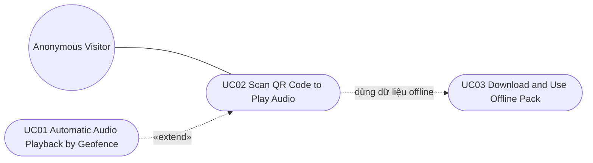

| **Use Case Number:**           | **UC02**                                                                                                                                                                                                                                                                                                                                                                  |                                                                                                                                                                   |
| :----------------------------- | :------------------------------------------------------------------------------------------------------------------------------------------------------------------------------------------------------------------------------------------------------------------------------------------------------------------------------------------------------------------------ | :---------------------------------------------------------------------------------------------------------------------------------------------------------------- |
| **Use Case Name:**             | Scan QR Code to Play Audio                                                                                                                                                                                                                                                                                                                                                |                                                                                                                                                                   |
| **Actor (s):**                 | Anonymous Visitor (Du khách)                                                                                                                                                                                                                                                                                                                                              |                                                                                                                                                                   |
| **Maturity:**                  | Focused                                                                                                                                                                                                                                                                                                                                                                   |                                                                                                                                                                   |
| **Summary:**                   | Du khách quét mã QR đặt tại POI để mở đúng POI và nghe thuyết minh theo ngôn ngữ đã chọn mà không phụ thuộc GPS. Mã QR chứa một URL dạng deep link có mã ngắn `qr_code`. Nếu POI chưa có audio cho ngôn ngữ đã chọn, hệ thống tạo audio ngay lúc đó; nếu tạo thất bại, hệ thống phát audio mặc định là audio tiếng Anh của chính POI đó. Trigger bằng QR bỏ qua cooldown. |                                                                                                                                                                   |
| **Basic Course of Events:**    | **Actor Action**                                                                                                                                                                                                                                                                                                                                                          | **System Response**                                                                                                                                               |
|                                | 1\. Du khách chọn chức năng “Quét QR” trên Mobile App. **A1**                                                                                                                                                                                                                                                                                                             |                                                                                                                                                                   |
|                                |                                                                                                                                                                                                                                                                                                                                                                           | 2\. Hệ thống kiểm tra quyền camera và yêu cầu cấp quyền nếu chưa có. **E1**                                                                                       |
|                                | 3\. Du khách hướng camera vào mã QR tại POI.                                                                                                                                                                                                                                                                                                                              |                                                                                                                                                                   |
|                                |                                                                                                                                                                                                                                                                                                                                                                           | 4\. Hệ thống giải mã QR và kiểm tra định dạng URL `https://{app-domain}/q/{qr_code}` (BR-11). **E2**                                                              |
|                                |                                                                                                                                                                                                                                                                                                                                                                           | 5\. Hệ thống tìm `qr_code` trong SQLite (dữ liệu đã sync hoặc Offline Pack); nếu không có và thiết bị có mạng, hệ thống gọi Backend API để tra cứu. **E3, E4**    |
|                                |                                                                                                                                                                                                                                                                                                                                                                           | 6\. Hệ thống hiển thị thông tin POI (tên, ảnh, mô tả ngắn) theo ngôn ngữ đã chọn.                                                                                 |
|                                |                                                                                                                                                                                                                                                                                                                                                                           | 7\. Hệ thống tìm audio của POI theo ngôn ngữ đã chọn: audio local/Offline Pack → audio cloud đã cache. **A2**                                                     |
|                                |                                                                                                                                                                                                                                                                                                                                                                           | 8\. Hệ thống kiểm tra có audio khác đang phát hay không. **A3**                                                                                                   |
|                                |                                                                                                                                                                                                                                                                                                                                                                           | 9\. Hệ thống phát audio ngay, không áp dụng cooldown (BR-05). **E6**                                                                                              |
|                                |                                                                                                                                                                                                                                                                                                                                                                           | 10\. Hệ thống ghi `qr_scan_event` và `audio_play_event` với `trigger_type = qr`; đồng bộ nếu có mạng, hoặc lưu local queue nếu offline. **E7**                    |
|                                | 11\. Du khách nghe thuyết minh. **A4**                                                                                                                                                                                                                                                                                                                                    |                                                                                                                                                                   |
|                                |                                                                                                                                                                                                                                                                                                                                                                           | 12\. Khi audio kết thúc, hệ thống ghi thời lượng nghe. The use case ends.                                                                                         |
|                                |                                                                                                                                                                                                                                                                                                                                                                           |                                                                                                                                                                   |
| **Alternative Paths:**         | **A1.** Du khách quét QR bằng ứng dụng camera mặc định của điện thoại.                                                                                                                                                                                                                                                                                                    |                                                                                                                                                                   |
|                                | **Actor Action**                                                                                                                                                                                                                                                                                                                                                          | **System Response**                                                                                                                                               |
|                                | 1\. Du khách quét QR bằng camera hệ thống.                                                                                                                                                                                                                                                                                                                                |                                                                                                                                                                   |
|                                |                                                                                                                                                                                                                                                                                                                                                                           | 2\. Nếu Mobile App đã được cài, hệ điều hành mở app qua deep link (Universal Link / App Link) kèm `qr_code`. Return to step 5 of the Basic Course of Events.      |
|                                |                                                                                                                                                                                                                                                                                                                                                                           | 3\. Nếu Mobile App chưa được cài, URL mở một landing page giới thiệu POI và hướng dẫn tải ứng dụng. The use case ends.                                            |
|                                | **A2.** POI chưa có audio cho ngôn ngữ đã chọn.                                                                                                                                                                                                                                                                                                                           |                                                                                                                                                                   |
|                                | **Actor Action**                                                                                                                                                                                                                                                                                                                                                          | **System Response**                                                                                                                                               |
|                                |                                                                                                                                                                                                                                                                                                                                                                           | 1\. Hệ thống hiển thị trạng thái “Đang chuẩn bị audio…”.                                                                                                          |
|                                |                                                                                                                                                                                                                                                                                                                                                                           | 2\. Hệ thống gửi yêu cầu tạo audio bằng Cloud TTS từ nội dung text của POI theo ngôn ngữ đã chọn. **E5**                                                          |
|                                |                                                                                                                                                                                                                                                                                                                                                                           | 3\. Backend tạo audio, lưu vào Object Storage, cập nhật audio metadata và trả URL audio cho Mobile App.                                                           |
|                                |                                                                                                                                                                                                                                                                                                                                                                           | 4\. Mobile App cache audio vừa tạo. Return to step 8 of the Basic Course of Events.                                                                               |
|                                | **A3.** Có audio khác đang phát.                                                                                                                                                                                                                                                                                                                                          |                                                                                                                                                                   |
|                                | **Actor Action**                                                                                                                                                                                                                                                                                                                                                          | **System Response**                                                                                                                                               |
|                                |                                                                                                                                                                                                                                                                                                                                                                           | 1\. Vì quét QR là hành động chủ động của du khách, hệ thống dừng audio cũ ngay và ghi trạng thái `interrupted` cho event cũ.                                      |
|                                |                                                                                                                                                                                                                                                                                                                                                                           | Return to step 9 of the Basic Course of Events.                                                                                                                   |
|                                | **A4.** Du khách điều khiển audio.                                                                                                                                                                                                                                                                                                                                        |                                                                                                                                                                   |
|                                | **Actor Action**                                                                                                                                                                                                                                                                                                                                                          | **System Response**                                                                                                                                               |
|                                | 1\. Du khách chọn Pause, Resume, Replay hoặc Stop.                                                                                                                                                                                                                                                                                                                        |                                                                                                                                                                   |
|                                |                                                                                                                                                                                                                                                                                                                                                                           | 2\. Hệ thống thực hiện thao tác tương ứng. Replay bằng QR hoặc thao tác thủ công không bị giới hạn bởi cooldown. Return to step 11 of the Basic Course of Events. |
| **Exception Paths:**           | **E1.** Du khách từ chối quyền camera. Hệ thống thông báo “Cần quyền camera để quét QR” và hướng dẫn bật lại trong Settings. Không có phương án nhập mã thủ công. The use case ends.                                                                                                                                                                                      |                                                                                                                                                                   |
|                                | **E2.** Nội dung QR không đúng định dạng hoặc không thuộc domain của hệ thống. Hệ thống thông báo “Mã QR không hợp lệ”. Return to step 3 of the Basic Course of Events.                                                                                                                                                                                                   |                                                                                                                                                                   |
|                                | **E3.** `qr_code` hợp lệ nhưng POI không tồn tại hoặc đã bị archive. Hệ thống thông báo “Mã QR không còn hiệu lực”. The use case ends.                                                                                                                                                                                                                                    |                                                                                                                                                                   |
|                                | **E4.** Thiết bị offline và POI không có trong dữ liệu local. Hệ thống thông báo “Cần kết nối Internet hoặc tải Offline Pack của khu vực này”. The use case ends.                                                                                                                                                                                                         |                                                                                                                                                                   |
|                                | **E5.** Tạo audio thất bại (offline, Cloud TTS lỗi, timeout hoặc hàng đợi TTS quá tải). Hệ thống phát **audio mặc định** là audio tiếng Anh của POI và ghi `audio_source = default_en`. Nếu POI cũng chưa có audio tiếng Anh, hệ thống hiển thị nội dung text kèm thông báo “Audio chưa sẵn sàng” và use case kết thúc. Return to step 8 of the Basic Course of Events.   |                                                                                                                                                                   |
|                                | **E6.** Audio Player không thể phát audio. Hệ thống thử phát lại 1 lần; nếu vẫn thất bại và ngôn ngữ đang chọn không phải English, hệ thống phát audio tiếng Anh của POI; nếu tiếp tục thất bại, hệ thống hiển thị thông báo lỗi. The use case ends.                                                                                                                      |                                                                                                                                                                   |
|                                | **E7.** Không thể đồng bộ event. Hệ thống lưu event vào local queue và retry khi có mạng. Return to step 11 of the Basic Course of Events.                                                                                                                                                                                                                                |                                                                                                                                                                   |
| **Extension Points:**          | **Generate Audio On Demand** — Khi POI chưa có audio cho ngôn ngữ đã chọn, hệ thống tạo audio bằng Cloud TTS ngay tại thời điểm quét. **A2, E5**                                                                                                                                                                                                                          |                                                                                                                                                                   |
| **Triggers:**                  | Du khách muốn nghe thuyết minh của POI bằng cách quét mã QR đặt tại POI.                                                                                                                                                                                                                                                                                                  |                                                                                                                                                                   |
| **Assumptions:**               | Mã QR được in từ Dashboard (UC05) và gắn đúng vị trí POI; mỗi POI `active` đều có nội dung và audio tiếng Anh (audio mặc định) theo BR-10.                                                                                                                                                                                                                                |                                                                                                                                                                   |
| **Preconditions:**             | Mobile App đã được cài đặt; du khách đã chọn ngôn ngữ (hoặc dùng mặc định English).                                                                                                                                                                                                                                                                                       |                                                                                                                                                                   |
| **Post Conditions:**           | Audio của POI theo ngôn ngữ đã chọn hoặc audio tiếng Anh của POI được phát; `qr_scan_event` và `audio_play_event` được lưu; nếu audio được tạo mới, audio đó được lưu cho các lượt nghe sau.                                                                                                                                                                              |                                                                                                                                                                   |
| **Reference: Business Rules:** | BR-01, BR-05, BR-09, BR-10, BR-11, BR-23, BR-24, BR-28                                                                                                                                                                                                                                                                                                                    |                                                                                                                                                                   |
| **Reference: Risks:**          | R-03, R-08                                                                                                                                                                                                                                                                                                                                                                |                                                                                                                                                                   |
| **Author(s):**                 | Khang Pham                                                                                                                                                                                                                                                                                                                                                                |                                                                                                                                                                   |
| **Date:**                      | 29-09-2026                                                                                                                                                                                                                                                                                                                                                                |                                                                                                                                                                   |
| **Activity Diagram:**          | Xem sơ đồ bên dưới.                                                                                                                                                                                                                                                                                                                                                       |                                                                                                                                                                   |

**Activity Diagram (UC02):**

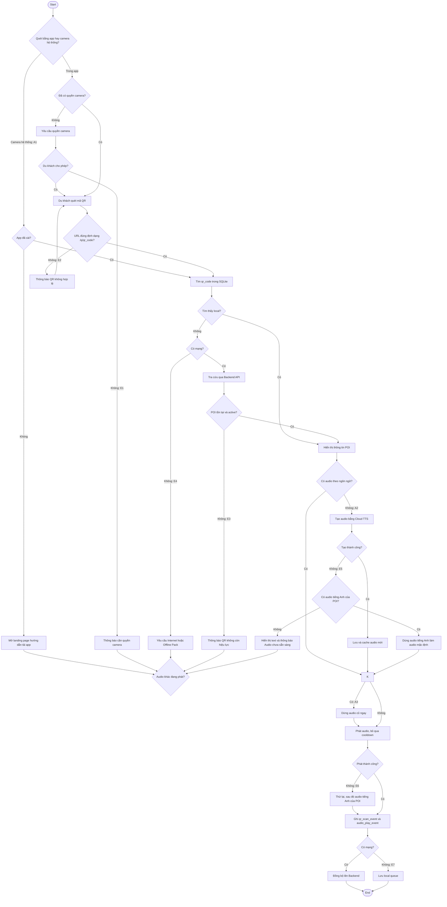

---

# **UC03 — Download and Use Offline Pack**

**Use Case Diagram (UC03):**

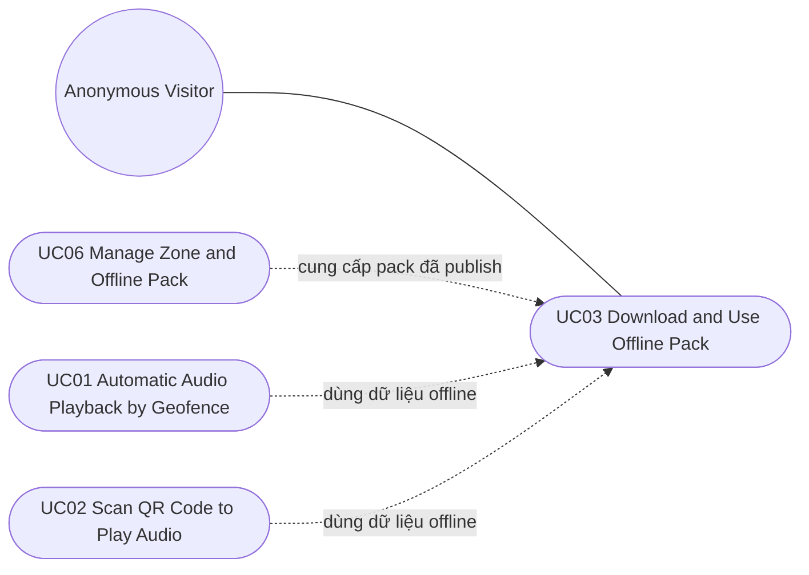

| **Use Case Number:**           | **UC03**                                                                                                                                                                                                                                                                                                                                                              |                                                                                                                                                                      |
| :----------------------------- | :-------------------------------------------------------------------------------------------------------------------------------------------------------------------------------------------------------------------------------------------------------------------------------------------------------------------------------------------------------------------- | :------------------------------------------------------------------------------------------------------------------------------------------------------------------- |
| **Use Case Name:**             | Download and Use Offline Pack                                                                                                                                                                                                                                                                                                                                         |                                                                                                                                                                      |
| **Actor (s):**                 | Anonymous Visitor (Du khách)                                                                                                                                                                                                                                                                                                                                          |                                                                                                                                                                      |
| **Maturity:**                  | Focused                                                                                                                                                                                                                                                                                                                                                               |                                                                                                                                                                      |
| **Summary:**                   | Du khách chủ động tải Offline Pack của một Zone (do POI Manager hoặc Admin tạo) để sử dụng bản đồ, nghe thuyết minh tự động và quét QR khi không có Internet. Mỗi pack gồm dữ liệu POI, nội dung đa ngôn ngữ, ảnh, bản đồ PMTiles và toàn bộ MP3. Việc tải chỉ thực hiện qua Wi-Fi; khi Zone có phiên bản mới, app tự động cập nhật; du khách có thể xóa pack đã tải. |                                                                                                                                                                      |
| **Basic Course of Events:**    | **Actor Action**                                                                                                                                                                                                                                                                                                                                                      | **System Response**                                                                                                                                                  |
|                                | 1\. Du khách mở mục “Offline Pack” trên Mobile App.                                                                                                                                                                                                                                                                                                                   |                                                                                                                                                                      |
|                                |                                                                                                                                                                                                                                                                                                                                                                       | 2\. Hệ thống hiển thị danh sách Zone có Offline Pack: tên Zone, số POI, dung lượng, phiên bản, trạng thái (chưa tải / đã tải / có bản cập nhật). **A1, E1**          |
|                                | 3\. Du khách chọn một Zone và chọn “Tải xuống”. **A2, A3**                                                                                                                                                                                                                                                                                                            |                                                                                                                                                                      |
|                                |                                                                                                                                                                                                                                                                                                                                                                       | 4\. Hệ thống kiểm tra thiết bị đang kết nối Wi-Fi (BR-13). **E2**                                                                                                    |
|                                |                                                                                                                                                                                                                                                                                                                                                                       | 5\. Hệ thống kiểm tra dung lượng trống của thiết bị so với dung lượng pack cộng biên an toàn. **E3**                                                                 |
|                                |                                                                                                                                                                                                                                                                                                                                                                       | 6\. Hệ thống tải manifest của pack, sau đó tải các thành phần: dữ liệu POI, nội dung đa ngôn ngữ, ảnh, file PMTiles và toàn bộ MP3; hiển thị tiến độ tải. **E4**     |
|                                |                                                                                                                                                                                                                                                                                                                                                                       | 7\. Hệ thống kiểm tra checksum của từng file theo manifest. **E5**                                                                                                   |
|                                |                                                                                                                                                                                                                                                                                                                                                                       | 8\. Hệ thống cài dữ liệu vào SQLite và local file system theo transaction, lưu `pack_version`. **E6**                                                                |
|                                |                                                                                                                                                                                                                                                                                                                                                                       | 9\. Hệ thống ghi `offline_pack_download_event` (Zone, phiên bản, `anonymous_device_id`, thời điểm) để phục vụ Analytics.                                             |
|                                |                                                                                                                                                                                                                                                                                                                                                                       | 10\. Hệ thống thông báo “Offline Pack đã sẵn sàng” và cập nhật trạng thái Zone thành “Đã tải”.                                                                       |
|                                | 11\. Du khách sử dụng bản đồ offline, **{Automatic Audio Playback by Geofence}** và **{Scan QR Code to Play Audio}** trong Zone mà không cần Internet. The use case ends.                                                                                                                                                                                             |                                                                                                                                                                      |
|                                |                                                                                                                                                                                                                                                                                                                                                                       |                                                                                                                                                                      |
| **Alternative Paths:**         | **A1.** Zone đã tải có phiên bản mới (tự động cập nhật).                                                                                                                                                                                                                                                                                                              |                                                                                                                                                                      |
|                                | **Actor Action**                                                                                                                                                                                                                                                                                                                                                      | **System Response**                                                                                                                                                  |
|                                |                                                                                                                                                                                                                                                                                                                                                                       | 1\. Khi có mạng, hệ thống so sánh `pack_version` local với phiên bản mới nhất trên Backend.                                                                          |
|                                |                                                                                                                                                                                                                                                                                                                                                                       | 2\. Nếu có phiên bản mới và thiết bị đang dùng Wi-Fi, hệ thống tự động tải phần thay đổi ở chế độ nền. Nếu chưa có Wi-Fi, hệ thống đánh dấu “Chờ Wi-Fi để cập nhật”. |
|                                |                                                                                                                                                                                                                                                                                                                                                                       | 3\. Sau khi tải xong, hệ thống thực hiện step 7 và step 8 of the Basic Course of Events; dữ liệu cũ chỉ bị thay thế khi bản mới cài đặt thành công.                  |
|                                |                                                                                                                                                                                                                                                                                                                                                                       | 4\. Hệ thống thông báo “Offline Pack đã được cập nhật”. Return to step 2 of the Basic Course of Events.                                                              |
|                                | **A2.** Du khách xóa Offline Pack đã tải.                                                                                                                                                                                                                                                                                                                             |                                                                                                                                                                      |
|                                | **Actor Action**                                                                                                                                                                                                                                                                                                                                                      | **System Response**                                                                                                                                                  |
|                                | 1\. Du khách chọn “Xóa” trên một Zone đã tải.                                                                                                                                                                                                                                                                                                                         |                                                                                                                                                                      |
|                                |                                                                                                                                                                                                                                                                                                                                                                       | 2\. Hệ thống hiển thị hộp thoại xác nhận, nêu dung lượng sẽ được giải phóng.                                                                                         |
|                                | 3\. Du khách xác nhận xóa.                                                                                                                                                                                                                                                                                                                                            |                                                                                                                                                                      |
|                                |                                                                                                                                                                                                                                                                                                                                                                       | 4\. Hệ thống xóa file và dữ liệu của Zone khỏi thiết bị; giữ lại event chưa đồng bộ trong local queue. Return to step 2 of the Basic Course of Events.               |
|                                | **A3.** Du khách hủy trong lúc đang tải.                                                                                                                                                                                                                                                                                                                              |                                                                                                                                                                      |
|                                | **Actor Action**                                                                                                                                                                                                                                                                                                                                                      | **System Response**                                                                                                                                                  |
|                                | 1\. Du khách chọn “Hủy tải”.                                                                                                                                                                                                                                                                                                                                          |                                                                                                                                                                      |
|                                |                                                                                                                                                                                                                                                                                                                                                                       | 2\. Hệ thống dừng tải, xóa các file tạm, giữ nguyên phiên bản cũ nếu có. Return to step 2 of the Basic Course of Events.                                             |
| **Exception Paths:**           | **E1.** Thiết bị không có mạng. Hệ thống chỉ hiển thị các pack đã tải và thông báo cần kết nối để xem danh sách đầy đủ. The use case ends.                                                                                                                                                                                                                            |                                                                                                                                                                      |
|                                | **E2.** Thiết bị không dùng Wi-Fi. Hệ thống thông báo “Chỉ có thể tải Offline Pack qua Wi-Fi” và không bắt đầu tải. Return to step 2 of the Basic Course of Events.                                                                                                                                                                                                   |                                                                                                                                                                      |
|                                | **E3.** Không đủ dung lượng trống. Hệ thống thông báo dung lượng cần thiết và gợi ý xóa pack khác (A2). Return to step 2 of the Basic Course of Events.                                                                                                                                                                                                               |                                                                                                                                                                      |
|                                | **E4.** Mất Wi-Fi hoặc lỗi mạng trong khi tải. Hệ thống tạm dừng và tự tiếp tục tải từ file còn dở khi có Wi-Fi trở lại. Return to step 6 of the Basic Course of Events.                                                                                                                                                                                              |                                                                                                                                                                      |
|                                | **E5.** Checksum của một file không khớp. Hệ thống tải lại file đó tối đa 3 lần; nếu vẫn lỗi, hệ thống hủy cài đặt và thông báo tải thất bại. Return to step 2 of the Basic Course of Events.                                                                                                                                                                         |                                                                                                                                                                      |
|                                | **E6.** Cài dữ liệu vào SQLite thất bại. Hệ thống rollback transaction, giữ nguyên phiên bản cũ (nếu có) và thông báo lỗi. Return to step 2 of the Basic Course of Events.                                                                                                                                                                                            |                                                                                                                                                                      |
| **Extension Points:**          | **Auto Update Offline Pack** — Tự động cập nhật khi Zone có phiên bản mới và thiết bị có Wi-Fi. **A1**                                                                                                                                                                                                                                                                |                                                                                                                                                                      |
| **Triggers:**                  | Du khách muốn chuẩn bị dữ liệu để tham quan một Zone khi không có Internet; hoặc hệ thống phát hiện pack đã tải có phiên bản mới.                                                                                                                                                                                                                                     |                                                                                                                                                                      |
| **Assumptions:**               | Offline Pack đã được POI Manager hoặc Admin build và publish qua **{Manage Zone and Offline Pack}**; các thành phần của pack có manifest và checksum.                                                                                                                                                                                                                 |                                                                                                                                                                      |
| **Preconditions:**             | Mobile App đã được cài đặt; thiết bị có Wi-Fi khi bắt đầu tải.                                                                                                                                                                                                                                                                                                        |                                                                                                                                                                      |
| **Post Conditions:**           | Offline Pack của Zone được cài đặt (hoặc cập nhật, hoặc xóa) trên thiết bị; `offline_pack_download_event` được ghi nhận.                                                                                                                                                                                                                                              |                                                                                                                                                                      |
| **Reference: Business Rules:** | BR-12, BR-13, BR-14, BR-15, BR-24                                                                                                                                                                                                                                                                                                                                     |                                                                                                                                                                      |
| **Reference: Risks:**          | R-04                                                                                                                                                                                                                                                                                                                                                                  |                                                                                                                                                                      |
| **Author(s):**                 | Khang Pham                                                                                                                                                                                                                                                                                                                                                            |                                                                                                                                                                      |
| **Date:**                      | 29-09-2026                                                                                                                                                                                                                                                                                                                                                            |                                                                                                                                                                      |
| **Activity Diagram:**          | Xem sơ đồ bên dưới.                                                                                                                                                                                                                                                                                                                                                   |                                                                                                                                                                      |

**Activity Diagram (UC03):**

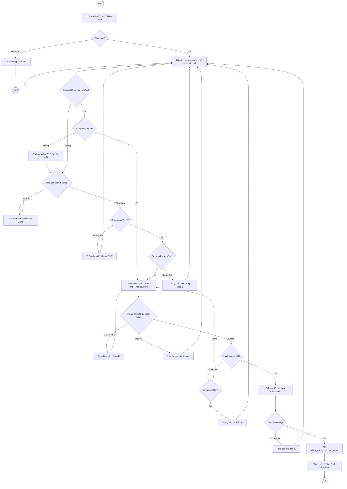

---

# **UC04 — Login Authentication**

**Use Case Diagram (UC04):**

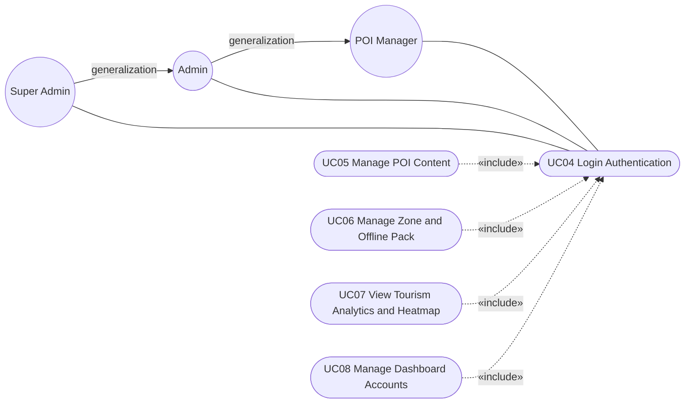

| **Use Case Number:**           | **UC04**                                                                                                                                                                                                                                                                        |                                                                                                                                                                                                                                                                                                                                                         |
| :----------------------------- | :------------------------------------------------------------------------------------------------------------------------------------------------------------------------------------------------------------------------------------------------------------------------------ | :------------------------------------------------------------------------------------------------------------------------------------------------------------------------------------------------------------------------------------------------------------------------------------------------------------------------------------------------------ |
| **Use Case Name:**             | Login Authentication                                                                                                                                                                                                                                                            |                                                                                                                                                                                                                                                                                                                                                         |
| **Actor (s):**                 | POI Manager, Admin, Super Admin                                                                                                                                                                                                                                                 |                                                                                                                                                                                                                                                                                                                                                         |
| **Maturity:**                  | Focused                                                                                                                                                                                                                                                                         |                                                                                                                                                                                                                                                                                                                                                         |
| **Summary:**                   | Tất cả actor quản trị đăng nhập vào Admin Dashboard qua một trang đăng nhập chung. Chức năng hiển thị theo role: POI Manager, Admin hoặc Super Admin. Hệ thống giới hạn số lần đăng nhập sai, hỗ trợ quên mật khẩu và yêu cầu MFA đơn giản (OTP qua email) đối với Super Admin. |                                                                                                                                                                                                                                                                                                                                                         |
| **Basic Course of Events:**    | **Actor Action**                                                                                                                                                                                                                                                                | **System Response**                                                                                                                                                                                                                                                                                                                                     |
|                                | 1\. Actor mở Admin Dashboard, nhập email và mật khẩu, chọn “Đăng nhập”. **A1**                                                                                                                                                                                                  |                                                                                                                                                                                                                                                                                                                                                         |
|                                |                                                                                                                                                                                                                                                                                 | 2\. Hệ thống tìm tài khoản theo email và kiểm tra trạng thái tài khoản. **E1, E2**                                                                                                                                                                                                                                                                      |
|                                |                                                                                                                                                                                                                                                                                 | 3\. Hệ thống so sánh mật khẩu với password hash đã lưu. **E3**                                                                                                                                                                                                                                                                                          |
|                                |                                                                                                                                                                                                                                                                                 | 4\. Hệ thống kiểm tra role của tài khoản. **A2**                                                                                                                                                                                                                                                                                                        |
|                                |                                                                                                                                                                                                                                                                                 | 5\. Hệ thống tạo access token và refresh token (thời hạn theo cấu hình hệ thống), lưu trong HttpOnly Cookie và đặt lại bộ đếm đăng nhập sai.                                                                                                                                                                                                            |
|                                |                                                                                                                                                                                                                                                                                 | 6\. Hệ thống tải role và permission của actor, bắt đầu một Session.                                                                                                                                                                                                                                                                                     |
|                                |                                                                                                                                                                                                                                                                                 | 7\. Hệ thống hiển thị chức năng theo role: **POI Manager**: Manage POI Content, Build Offline Pack (trong Manage Zone and Offline Pack), View Tourism Analytics and Heatmap, Log Off. **Admin**: các chức năng của POI Manager, quản lý Zone, cấu hình hệ thống, Log Off. **Super Admin**: các chức năng của Admin, Manage Dashboard Accounts, Log Off. |
|                                |                                                                                                                                                                                                                                                                                 | 8\. Hệ thống ghi Audit Log “login_success” và chuyển actor đến Home page. The use case ends.                                                                                                                                                                                                                                                            |
|                                |                                                                                                                                                                                                                                                                                 |                                                                                                                                                                                                                                                                                                                                                         |
| **Alternative Paths:**         | **A1.** Actor quên mật khẩu.                                                                                                                                                                                                                                                    |                                                                                                                                                                                                                                                                                                                                                         |
|                                | **Actor Action**                                                                                                                                                                                                                                                                | **System Response**                                                                                                                                                                                                                                                                                                                                     |
|                                | 1\. Actor chọn “Quên mật khẩu” và nhập email.                                                                                                                                                                                                                                   |                                                                                                                                                                                                                                                                                                                                                         |
|                                |                                                                                                                                                                                                                                                                                 | 2\. Hệ thống luôn hiển thị cùng một thông báo “Nếu email tồn tại, liên kết đặt lại mật khẩu đã được gửi” để không tiết lộ tài khoản tồn tại hay không.                                                                                                                                                                                                  |
|                                |                                                                                                                                                                                                                                                                                 | 3\. Nếu email tồn tại, hệ thống gửi liên kết đặt lại mật khẩu dùng một lần, có thời hạn theo cấu hình (đề xuất 30 phút).                                                                                                                                                                                                                                |
|                                | 4\. Actor mở liên kết và nhập mật khẩu mới hai lần.                                                                                                                                                                                                                             |                                                                                                                                                                                                                                                                                                                                                         |
|                                |                                                                                                                                                                                                                                                                                 | 5\. Hệ thống kiểm tra liên kết còn hiệu lực và mật khẩu đạt chính sách (BR-17). **E5**                                                                                                                                                                                                                                                                  |
|                                |                                                                                                                                                                                                                                                                                 | 6\. Hệ thống cập nhật password hash, hủy mọi refresh token cũ, ghi Audit Log. Return to step 1 of the Basic Course of Events.                                                                                                                                                                                                                           |
|                                | **A2.** Actor là Super Admin (MFA).                                                                                                                                                                                                                                             |                                                                                                                                                                                                                                                                                                                                                         |
|                                | **Actor Action**                                                                                                                                                                                                                                                                | **System Response**                                                                                                                                                                                                                                                                                                                                     |
|                                |                                                                                                                                                                                                                                                                                 | 1\. Hệ thống gửi mã OTP 6 chữ số đến email của Super Admin, OTP hết hạn sau 5 phút (BR-18).                                                                                                                                                                                                                                                             |
|                                | 2\. Super Admin nhập mã OTP.                                                                                                                                                                                                                                                    |                                                                                                                                                                                                                                                                                                                                                         |
|                                |                                                                                                                                                                                                                                                                                 | 3\. Hệ thống xác thực OTP. **E4**                                                                                                                                                                                                                                                                                                                       |
|                                |                                                                                                                                                                                                                                                                                 | Return to step 5 of the Basic Course of Events.                                                                                                                                                                                                                                                                                                         |
| **Exception Paths:**           | **E1.** Không tìm thấy email. Hệ thống hiển thị thông báo chung “Email hoặc mật khẩu không đúng” và tăng bộ đếm đăng nhập sai theo email/IP. Return to step 1 of the Basic Course of Events.                                                                                    |                                                                                                                                                                                                                                                                                                                                                         |
|                                | **E2.** Tài khoản đang bị khóa (do Super Admin khóa hoặc do vượt số lần đăng nhập sai). Hệ thống thông báo tài khoản tạm khóa và thời điểm có thể thử lại, hoặc yêu cầu liên hệ Super Admin. The use case ends.                                                                 |                                                                                                                                                                                                                                                                                                                                                         |
|                                | **E3.** Mật khẩu không đúng. Hệ thống hiển thị thông báo chung “Email hoặc mật khẩu không đúng”, tăng bộ đếm sai. Nếu sai 5 lần liên tiếp, hệ thống khóa tài khoản 15 phút (BR-16) và ghi Audit Log “account_locked”. Return to step 1 of the Basic Course of Events.           |                                                                                                                                                                                                                                                                                                                                                         |
|                                | **E4.** OTP sai hoặc hết hạn. Hệ thống cho phép nhập lại tối đa 3 lần hoặc chọn “Gửi lại mã”; vượt số lần cho phép thì hủy phiên đăng nhập. Return to step 1 of the Basic Course of Events.                                                                                     |                                                                                                                                                                                                                                                                                                                                                         |
|                                | **E5.** Liên kết đặt lại mật khẩu hết hạn/đã dùng, hoặc mật khẩu mới không đạt chính sách. Hệ thống thông báo lỗi tương ứng. Return to step 1 of Alternative Path A1.                                                                                                           |                                                                                                                                                                                                                                                                                                                                                         |
| **Extension Points:**          | **Verify MFA** — Chỉ áp dụng với Super Admin. **A2**                                                                                                                                                                                                                            |                                                                                                                                                                                                                                                                                                                                                         |
|                                | **Reset Password** — Khi actor chọn “Quên mật khẩu”. **A1**                                                                                                                                                                                                                     |                                                                                                                                                                                                                                                                                                                                                         |
| **Triggers:**                  | Actor truy cập Admin Dashboard nhưng chưa có Session; Session hết hạn do không hoạt động hoặc refresh token hết hạn; actor đã chọn Log Off.                                                                                                                                     |                                                                                                                                                                                                                                                                                                                                                         |
| **Assumptions:**               | Tài khoản đã được Super Admin tạo qua **{Manage Dashboard Accounts}**; hệ thống có dịch vụ gửi email.                                                                                                                                                                           |                                                                                                                                                                                                                                                                                                                                                         |
| **Preconditions:**             | Actor đang truy cập Admin Dashboard và không có Session hợp lệ, vì vậy được chuyển đến trang Login.                                                                                                                                                                             |                                                                                                                                                                                                                                                                                                                                                         |
| **Post Conditions:**           | Actor có Session hợp lệ, đang ở Home page và chỉ thấy các chức năng phù hợp với role.                                                                                                                                                                                           |                                                                                                                                                                                                                                                                                                                                                         |
| **Reference: Business Rules:** | BR-16, BR-17, BR-18, BR-19, BR-20, BR-22                                                                                                                                                                                                                                        |                                                                                                                                                                                                                                                                                                                                                         |
| **Reference: Risks:**          | R-06                                                                                                                                                                                                                                                                            |                                                                                                                                                                                                                                                                                                                                                         |
| **Author(s):**                 | Khang Pham                                                                                                                                                                                                                                                                      |                                                                                                                                                                                                                                                                                                                                                         |
| **Date:**                      | 29-09-2026                                                                                                                                                                                                                                                                      |                                                                                                                                                                                                                                                                                                                                                         |
| **Activity Diagram:**          | Xem sơ đồ bên dưới.                                                                                                                                                                                                                                                             |                                                                                                                                                                                                                                                                                                                                                         |

**Activity Diagram (UC04):**

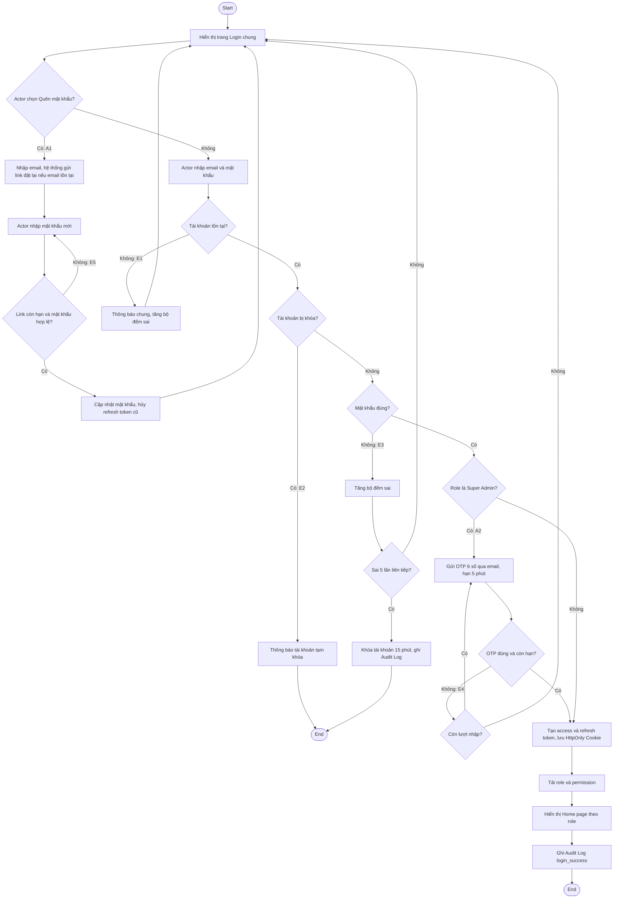

---

# **UC05 — Manage POI Content**

**Use Case Diagram (UC05):**

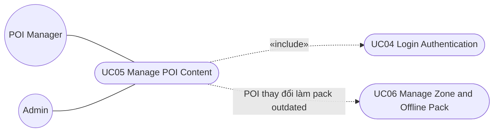

| **Use Case Number:**           | **UC05**                                                                                                                                                                                                                                                                                                                                                                                                                                                                              |                                                                                                                                                                                                                                                              |
| :----------------------------- | :------------------------------------------------------------------------------------------------------------------------------------------------------------------------------------------------------------------------------------------------------------------------------------------------------------------------------------------------------------------------------------------------------------------------------------------------------------------------------------ | :----------------------------------------------------------------------------------------------------------------------------------------------------------------------------------------------------------------------------------------------------------- |
| **Use Case Name:**             | Manage POI Content                                                                                                                                                                                                                                                                                                                                                                                                                                                                    |                                                                                                                                                                                                                                                              |
| **Actor (s):**                 | POI Manager, Admin                                                                                                                                                                                                                                                                                                                                                                                                                                                                    |                                                                                                                                                                                                                                                              |
| **Maturity:**                  | Focused                                                                                                                                                                                                                                                                                                                                                                                                                                                                               |                                                                                                                                                                                                                                                              |
| **Summary:**                   | POI Manager (toàn quyền với POI) hoặc Admin (can thiệp khi cần) tạo, chỉnh sửa, archive và khôi phục POI, bao gồm thông tin vị trí, Zone, ảnh, nội dung thuyết minh đa ngôn ngữ, audio và mã QR. Mỗi POI bắt buộc có nội dung tiếng Anh; audio tiếng Anh được dùng làm audio mặc định cho mọi ngôn ngữ còn thiếu. Riêng cấu hình bán kính geofence là quyền của Admin. Thay đổi có hiệu lực ngay, không qua bước kiểm duyệt; mọi thay đổi được ghi Audit Log và có lịch sử phiên bản. |                                                                                                                                                                                                                                                              |
| **Basic Course of Events:**    | **Actor Action**                                                                                                                                                                                                                                                                                                                                                                                                                                                                      | **System Response**                                                                                                                                                                                                                                          |
|                                | 1\. Perform **{Login Authentication}**                                                                                                                                                                                                                                                                                                                                                                                                                                                |                                                                                                                                                                                                                                                              |
|                                |                                                                                                                                                                                                                                                                                                                                                                                                                                                                                       | 2\. System displays welcome page with main features for actor to choose from.                                                                                                                                                                                |
|                                | 3\. Actor chọn “Quản lý POI”.                                                                                                                                                                                                                                                                                                                                                                                                                                                         |                                                                                                                                                                                                                                                              |
|                                |                                                                                                                                                                                                                                                                                                                                                                                                                                                                                       | 4\. Hệ thống hiển thị danh sách tất cả POI, có bộ lọc theo Zone, trạng thái (`active`, `archived`) và ô tìm kiếm.                                                                                                                                            |
|                                | 5\. Actor chọn “Tạo POI” hoặc chọn một POI để chỉnh sửa. **A1, A2, A3**                                                                                                                                                                                                                                                                                                                                                                                                               |                                                                                                                                                                                                                                                              |
|                                |                                                                                                                                                                                                                                                                                                                                                                                                                                                                                       | 6\. Hệ thống hiển thị form POI: tên, mô tả ngắn, tọa độ (chọn trên bản đồ), Zone, `priority`, ảnh, nội dung thuyết minh theo từng ngôn ngữ, audio theo từng ngôn ngữ, mã QR.                                                                                 |
|                                | 7\. Actor nhập/chỉnh thông tin và nội dung thuyết minh cho từng ngôn ngữ. (Lặp lại cho mỗi ngôn ngữ nếu cần.)                                                                                                                                                                                                                                                                                                                                                                         |                                                                                                                                                                                                                                                              |
|                                | 8\. Actor upload file MP3 cho từng ngôn ngữ, hoặc chọn “Tạo audio bằng TTS”. **A4**                                                                                                                                                                                                                                                                                                                                                                                                   |                                                                                                                                                                                                                                                              |
|                                | 9\. Actor chọn “Lưu”. **A5**                                                                                                                                                                                                                                                                                                                                                                                                                                                          |                                                                                                                                                                                                                                                              |
|                                |                                                                                                                                                                                                                                                                                                                                                                                                                                                                                       | 10\. Hệ thống validate dữ liệu POI. **{Validate POI Content}**                                                                                                                                                                                               |
|                                |                                                                                                                                                                                                                                                                                                                                                                                                                                                                                       | 11\. Hệ thống lưu POI ở trạng thái `active`, tăng `content_version`, lưu snapshot phiên bản cũ; nếu là POI mới, hệ thống tự sinh `qr_code` duy nhất; nếu chưa có MP3 tiếng Anh, hệ thống tự tạo TTS task tiếng Anh để làm audio mặc định (BR-10). **E3, E4** |
|                                |                                                                                                                                                                                                                                                                                                                                                                                                                                                                                       | 12\. Hệ thống đưa thay đổi vào Delta Sync và đánh dấu Offline Pack của Zone liên quan là `outdated`.                                                                                                                                                         |
|                                |                                                                                                                                                                                                                                                                                                                                                                                                                                                                                       | 13\. Hệ thống ghi Audit Log (actor, thời điểm, hành động, dữ liệu trước/sau) và thông báo lưu thành công. **A6** The use case ends.                                                                                                                          |
|                                |                                                                                                                                                                                                                                                                                                                                                                                                                                                                                       |                                                                                                                                                                                                                                                              |
| **Alternative Paths:**         | **A1.** Archive POI (soft delete).                                                                                                                                                                                                                                                                                                                                                                                                                                                    |                                                                                                                                                                                                                                                              |
|                                | **Actor Action**                                                                                                                                                                                                                                                                                                                                                                                                                                                                      | **System Response**                                                                                                                                                                                                                                          |
|                                | 1\. Actor chọn “Archive” trên một POI.                                                                                                                                                                                                                                                                                                                                                                                                                                                |                                                                                                                                                                                                                                                              |
|                                |                                                                                                                                                                                                                                                                                                                                                                                                                                                                                       | 2\. Hệ thống yêu cầu xác nhận.                                                                                                                                                                                                                               |
|                                | 3\. Actor xác nhận.                                                                                                                                                                                                                                                                                                                                                                                                                                                                   |                                                                                                                                                                                                                                                              |
|                                |                                                                                                                                                                                                                                                                                                                                                                                                                                                                                       | 4\. Hệ thống chuyển POI sang `archived`: POI không còn hiển thị trên Mobile App, QR của POI trả về “không còn hiệu lực”, dữ liệu và Analytics lịch sử vẫn được giữ. Return to step 12 of the Basic Course of Events.                                         |
|                                | **A2.** Khôi phục POI đã archive.                                                                                                                                                                                                                                                                                                                                                                                                                                                     |                                                                                                                                                                                                                                                              |
|                                | **Actor Action**                                                                                                                                                                                                                                                                                                                                                                                                                                                                      | **System Response**                                                                                                                                                                                                                                          |
|                                | 1\. Actor lọc trạng thái `archived`, chọn POI và chọn “Khôi phục”.                                                                                                                                                                                                                                                                                                                                                                                                                    |                                                                                                                                                                                                                                                              |
|                                |                                                                                                                                                                                                                                                                                                                                                                                                                                                                                       | 2\. Hệ thống chuyển POI về `active`. Return to step 12 of the Basic Course of Events.                                                                                                                                                                        |
|                                | **A3.** Cấu hình bán kính geofence mặc định (chỉ Admin và Super Admin).                                                                                                                                                                                                                                                                                                                                                                                                               |                                                                                                                                                                                                                                                              |
|                                | **Actor Action**                                                                                                                                                                                                                                                                                                                                                                                                                                                                      | **System Response**                                                                                                                                                                                                                                          |
|                                | 1\. Admin chọn “Cấu hình geofence” và nhập bán kính mới (mặc định 30 m). Chức năng này không hiển thị với POI Manager.                                                                                                                                                                                                                                                                                                                                                                |                                                                                                                                                                                                                                                              |
|                                |                                                                                                                                                                                                                                                                                                                                                                                                                                                                                       | 2\. Hệ thống kiểm tra giá trị nằm trong khoảng cho phép (đề xuất 10 m – 200 m). **E1**                                                                                                                                                                       |
|                                |                                                                                                                                                                                                                                                                                                                                                                                                                                                                                       | 3\. Hệ thống lưu cấu hình, áp dụng cho tất cả POI và đưa vào Delta Sync. Return to step 13 of the Basic Course of Events.                                                                                                                                    |
|                                | **A4.** Tạo audio bằng TTS.                                                                                                                                                                                                                                                                                                                                                                                                                                                           |                                                                                                                                                                                                                                                              |
|                                | **Actor Action**                                                                                                                                                                                                                                                                                                                                                                                                                                                                      | **System Response**                                                                                                                                                                                                                                          |
|                                |                                                                                                                                                                                                                                                                                                                                                                                                                                                                                       | 1\. Hệ thống tạo TTS task bất đồng bộ cho ngôn ngữ đã chọn từ nội dung text; audio ở trạng thái `processing`.                                                                                                                                                |
|                                |                                                                                                                                                                                                                                                                                                                                                                                                                                                                                       | 2\. Khi hoàn tất, hệ thống lưu audio và chuyển trạng thái `ready`; nếu thất bại, chuyển `failed` và cho phép thử lại.                                                                                                                                        |
|                                |                                                                                                                                                                                                                                                                                                                                                                                                                                                                                       | Return to step 9 of the Basic Course of Events.                                                                                                                                                                                                              |
|                                | **A5.** Hủy chỉnh sửa.                                                                                                                                                                                                                                                                                                                                                                                                                                                                |                                                                                                                                                                                                                                                              |
|                                | **Actor Action**                                                                                                                                                                                                                                                                                                                                                                                                                                                                      | **System Response**                                                                                                                                                                                                                                          |
|                                | 1\. Actor chọn “Hủy”.                                                                                                                                                                                                                                                                                                                                                                                                                                                                 |                                                                                                                                                                                                                                                              |
|                                |                                                                                                                                                                                                                                                                                                                                                                                                                                                                                       | 2\. Hệ thống bỏ các thay đổi chưa lưu, giữ phiên bản đã lưu trước đó. Return to step 4 of the Basic Course of Events.                                                                                                                                        |
|                                | **A6.** Tải mã QR để in.                                                                                                                                                                                                                                                                                                                                                                                                                                                              |                                                                                                                                                                                                                                                              |
|                                | **Actor Action**                                                                                                                                                                                                                                                                                                                                                                                                                                                                      | **System Response**                                                                                                                                                                                                                                          |
|                                | 1\. Actor chọn “Tải QR”.                                                                                                                                                                                                                                                                                                                                                                                                                                                              |                                                                                                                                                                                                                                                              |
|                                |                                                                                                                                                                                                                                                                                                                                                                                                                                                                                       | 2\. Hệ thống xuất ảnh QR (PNG/SVG) chứa URL `https://{app-domain}/q/{qr_code}`, kèm tên POI bên dưới. The use case ends.                                                                                                                                     |
| **Exception Paths:**           | **E1.** Tại **{Validate POI Content}**, nếu thiếu trường bắt buộc (tên, tọa độ, Zone, nội dung thuyết minh ít nhất bằng English), hoặc tọa độ không hợp lệ / nằm ngoài ranh giới Zone, hoặc giá trị cấu hình ngoài khoảng cho phép, hệ thống đánh dấu các trường lỗi. Return to step 7 of the Basic Course of Events.                                                                                                                                                                 |                                                                                                                                                                                                                                                              |
|                                | **E2.** File ảnh hoặc audio sai định dạng hoặc vượt dung lượng tối đa (theo cấu hình hệ thống). Hệ thống từ chối file và hiển thị lý do. Return to step 8 of the Basic Course of Events.                                                                                                                                                                                                                                                                                              |                                                                                                                                                                                                                                                              |
|                                | **E3.** Tạo audio TTS thất bại. Audio chuyển sang `failed`; actor có thể thử lại hoặc upload MP3. POI vẫn được lưu; Mobile App dùng audio tiếng Anh của POI cho ngôn ngữ đó cho đến khi có audio. Nếu audio tiếng Anh bị lỗi, hệ thống hiển thị cảnh báo “POI chưa có audio mặc định” trên danh sách POI. Return to step 8 of the Basic Course of Events.                                                                                                                             |                                                                                                                                                                                                                                                              |
|                                | **E4.** Xung đột chỉnh sửa đồng thời (POI đã bị người khác lưu với `content_version` mới hơn). Hệ thống từ chối lưu, hiển thị khác biệt và yêu cầu actor tải lại. Return to step 6 of the Basic Course of Events.                                                                                                                                                                                                                                                                     |                                                                                                                                                                                                                                                              |
| **Extension Points:**          | **Validate POI Content** — Kiểm tra trường bắt buộc, định dạng tọa độ, tọa độ nằm trong Zone, định dạng/dung lượng file. (See Business Rule BR-21) **E1, E2**                                                                                                                                                                                                                                                                                                                         |                                                                                                                                                                                                                                                              |
| **Triggers:**                  | Actor muốn tạo mới, cập nhật, archive hoặc khôi phục POI; hoặc Admin cần thay đổi bán kính geofence mặc định.                                                                                                                                                                                                                                                                                                                                                                         |                                                                                                                                                                                                                                                              |
| **Assumptions:**               | Có ít nhất một Zone đã được Admin tạo trong **{Manage Zone and Offline Pack}**; nội dung do POI Manager nhập là chính xác vì không có bước kiểm duyệt.                                                                                                                                                                                                                                                                                                                                |                                                                                                                                                                                                                                                              |
| **Preconditions:**             | Actor đã đăng nhập với role POI Manager, Admin hoặc Super Admin.                                                                                                                                                                                                                                                                                                                                                                                                                      |                                                                                                                                                                                                                                                              |
| **Post Conditions:**           | POI được lưu với `content_version` mới và có hiệu lực ngay trên Mobile App qua Delta Sync; Offline Pack của Zone bị đánh dấu `outdated`; Audit Log được ghi.                                                                                                                                                                                                                                                                                                                          |                                                                                                                                                                                                                                                              |
| **Reference: Business Rules:** | BR-02, BR-10, BR-11, BR-19, BR-20, BR-21, BR-22, BR-28                                                                                                                                                                                                                                                                                                                                                                                                                                |                                                                                                                                                                                                                                                              |
| **Reference: Risks:**          | R-05                                                                                                                                                                                                                                                                                                                                                                                                                                                                                  |                                                                                                                                                                                                                                                              |
| **Author(s):**                 | Khang Pham                                                                                                                                                                                                                                                                                                                                                                                                                                                                            |                                                                                                                                                                                                                                                              |
| **Date:**                      | 29-09-2026                                                                                                                                                                                                                                                                                                                                                                                                                                                                            |                                                                                                                                                                                                                                                              |
| **Activity Diagram:**          | Xem sơ đồ bên dưới.                                                                                                                                                                                                                                                                                                                                                                                                                                                                   |                                                                                                                                                                                                                                                              |

**Activity Diagram (UC05):**

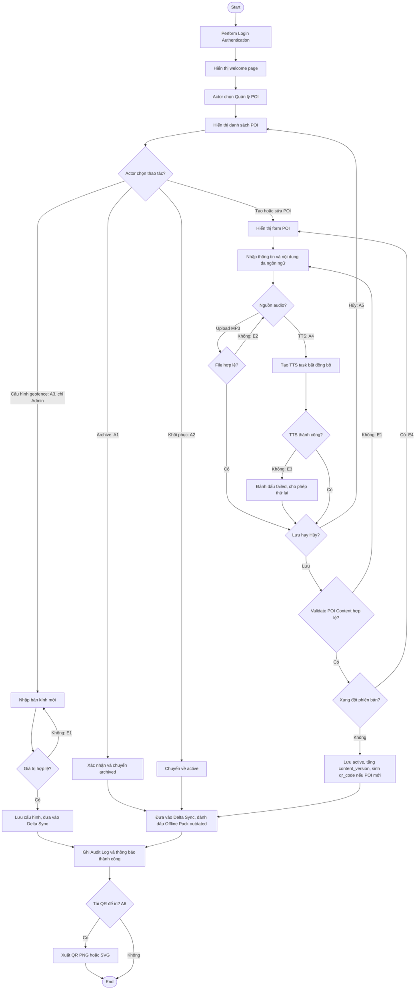

---

# **UC06 — Manage Zone and Offline Pack**

**Use Case Diagram (UC06):**

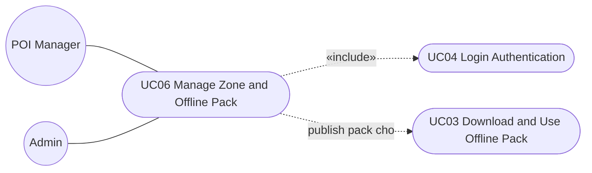

| **Use Case Number:**           | **UC06**                                                                                                                                                                                                                                                                                                                                                                                       |                                                                                                                                                                                                      |
| :----------------------------- | :--------------------------------------------------------------------------------------------------------------------------------------------------------------------------------------------------------------------------------------------------------------------------------------------------------------------------------------------------------------------------------------------- | :--------------------------------------------------------------------------------------------------------------------------------------------------------------------------------------------------- |
| **Use Case Name:**             | Manage Zone and Offline Pack                                                                                                                                                                                                                                                                                                                                                                   |                                                                                                                                                                                                      |
| **Actor (s):**                 | POI Manager (chỉ build Offline Pack), Admin                                                                                                                                                                                                                                                                                                                                                    |                                                                                                                                                                                                      |
| **Maturity:**                  | Focused                                                                                                                                                                                                                                                                                                                                                                                        |                                                                                                                                                                                                      |
| **Summary:**                   | Admin tạo và quản lý Zone (khu vực tham quan có ranh giới trên bản đồ); POI Manager hoặc Admin build và publish Offline Pack cho từng Zone từ các POI thuộc Zone đó. Mỗi pack gồm dữ liệu POI, nội dung đa ngôn ngữ, ảnh, bản đồ PMTiles cắt theo ranh giới Zone và toàn bộ MP3, kèm manifest và checksum để Mobile App tải và tự động cập nhật.                                               |                                                                                                                                                                                                      |
| **Basic Course of Events:**    | **Actor Action**                                                                                                                                                                                                                                                                                                                                                                               | **System Response**                                                                                                                                                                                  |
|                                | 1\. Perform **{Login Authentication}**                                                                                                                                                                                                                                                                                                                                                         |                                                                                                                                                                                                      |
|                                |                                                                                                                                                                                                                                                                                                                                                                                                | 2\. System displays welcome page with main features for actor to choose from.                                                                                                                        |
|                                | 3\. Actor chọn “Quản lý Zone & Offline Pack”.                                                                                                                                                                                                                                                                                                                                                  |                                                                                                                                                                                                      |
|                                |                                                                                                                                                                                                                                                                                                                                                                                                | 4\. Hệ thống hiển thị danh sách Zone: tên, số POI `active`, `pack_version`, trạng thái pack (`up_to_date`, `outdated`, `building`, `failed`), dung lượng, thời điểm build gần nhất.                  |
|                                | 5\. Actor chọn một Zone. **A1, A2**                                                                                                                                                                                                                                                                                                                                                            |                                                                                                                                                                                                      |
|                                |                                                                                                                                                                                                                                                                                                                                                                                                | 6\. Hệ thống hiển thị chi tiết Zone, ranh giới trên bản đồ, danh sách POI thuộc Zone và tình trạng audio theo từng ngôn ngữ.                                                                         |
|                                | 7\. Actor chọn “Build Offline Pack”.                                                                                                                                                                                                                                                                                                                                                           |                                                                                                                                                                                                      |
|                                |                                                                                                                                                                                                                                                                                                                                                                                                | 8\. Hệ thống kiểm tra điều kiện build: Zone có ít nhất 1 POI `active`; mỗi POI có audio tiếng Anh `ready` (bắt buộc) và audio các ngôn ngữ khác (khuyến nghị). **E1**                                |
|                                |                                                                                                                                                                                                                                                                                                                                                                                                | 9\. Hệ thống tạo build job bất đồng bộ: xuất dữ liệu POI và nội dung đa ngôn ngữ, nén ảnh, cắt PMTiles theo ranh giới Zone, gom MP3, tạo manifest và checksum; trạng thái pack là `building`. **E2** |
|                                |                                                                                                                                                                                                                                                                                                                                                                                                | 10\. Khi build thành công, hệ thống tăng `pack_version`, publish pack lên Object Storage/CDN và chuyển trạng thái `up_to_date`.                                                                      |
|                                |                                                                                                                                                                                                                                                                                                                                                                                                | 11\. Hệ thống ghi Audit Log và thông báo publish thành công; Mobile App đã tải Zone này sẽ tự động cập nhật khi có Wi-Fi (BR-14). The use case ends.                                                 |
|                                |                                                                                                                                                                                                                                                                                                                                                                                                |                                                                                                                                                                                                      |
| **Alternative Paths:**         | **A1.** Tạo hoặc chỉnh sửa Zone (chỉ Admin và Super Admin).                                                                                                                                                                                                                                                                                                                                    |                                                                                                                                                                                                      |
|                                | **Actor Action**                                                                                                                                                                                                                                                                                                                                                                               | **System Response**                                                                                                                                                                                  |
|                                | 1\. Actor chọn “Tạo Zone” hoặc “Sửa Zone”.                                                                                                                                                                                                                                                                                                                                                     |                                                                                                                                                                                                      |
|                                |                                                                                                                                                                                                                                                                                                                                                                                                | 2\. Hệ thống hiển thị form: tên Zone đa ngôn ngữ, mô tả, ảnh bìa, công cụ vẽ ranh giới (polygon) trên bản đồ.                                                                                        |
|                                | 3\. Actor nhập thông tin và vẽ ranh giới Zone.                                                                                                                                                                                                                                                                                                                                                 |                                                                                                                                                                                                      |
|                                |                                                                                                                                                                                                                                                                                                                                                                                                | 4\. Hệ thống kiểm tra tên không trùng và polygon hợp lệ. **E3**                                                                                                                                      |
|                                |                                                                                                                                                                                                                                                                                                                                                                                                | 5\. Hệ thống lưu Zone, ghi Audit Log. Return to step 4 of the Basic Course of Events.                                                                                                                |
|                                | **A2.** Archive Zone (chỉ Admin và Super Admin).                                                                                                                                                                                                                                                                                                                                               |                                                                                                                                                                                                      |
|                                | **Actor Action**                                                                                                                                                                                                                                                                                                                                                                               | **System Response**                                                                                                                                                                                  |
|                                | 1\. Actor chọn “Archive Zone”.                                                                                                                                                                                                                                                                                                                                                                 |                                                                                                                                                                                                      |
|                                |                                                                                                                                                                                                                                                                                                                                                                                                | 2\. Hệ thống yêu cầu xác nhận và cảnh báo Zone còn bao nhiêu POI `active`. **E4**                                                                                                                    |
|                                | 3\. Actor xác nhận.                                                                                                                                                                                                                                                                                                                                                                            |                                                                                                                                                                                                      |
|                                |                                                                                                                                                                                                                                                                                                                                                                                                | 4\. Hệ thống ẩn Zone và Offline Pack khỏi danh sách tải trên Mobile App (thiết bị đã tải vẫn dùng được bản cũ), ghi Audit Log. Return to step 4 of the Basic Course of Events.                       |
| **Exception Paths:**           | **E1.** Zone không có POI `active`, hoặc có POI chưa có audio tiếng Anh `ready`. Hệ thống chặn build, liệt kê các POI còn thiếu và cho phép actor tạo audio TTS hàng loạt, sau đó build lại. Return to step 6 of the Basic Course of Events. Nếu chỉ thiếu audio ở ngôn ngữ khác English, hệ thống vẫn cho build kèm cảnh báo; Mobile App sẽ dùng audio tiếng Anh của POI cho các ngôn ngữ đó. |                                                                                                                                                                                                      |
|                                | **E2.** Build job thất bại (lỗi cắt PMTiles, thiếu file, lỗi lưu trữ). Hệ thống chuyển trạng thái `failed`, giữ nguyên pack phiên bản trước cho Mobile App, ghi log chi tiết và cho phép build lại. Return to step 6 of the Basic Course of Events.                                                                                                                                            |                                                                                                                                                                                                      |
|                                | **E3.** Tên Zone bị trùng hoặc polygon không hợp lệ (tự cắt, không khép kín). Hệ thống đánh dấu lỗi. Return to step 3 of Alternative Path A1.                                                                                                                                                                                                                                                  |                                                                                                                                                                                                      |
|                                | **E4.** Zone còn POI `active`. Hệ thống yêu cầu actor chuyển POI sang Zone khác hoặc archive POI trước. Return to step 6 of the Basic Course of Events.                                                                                                                                                                                                                                        |                                                                                                                                                                                                      |
| **Extension Points:**          | **Batch Generate Missing Audio** — Tạo audio TTS hàng loạt cho POI thiếu audio trước khi build. **E1**                                                                                                                                                                                                                                                                                         |                                                                                                                                                                                                      |
| **Triggers:**                  | Admin muốn tạo/chỉnh sửa Zone; hoặc Offline Pack của Zone ở trạng thái `outdated` sau khi POI thay đổi trong **{Manage POI Content}**.                                                                                                                                                                                                                                                         |                                                                                                                                                                                                      |
| **Assumptions:**               | Hệ thống có dữ liệu bản đồ nguồn để cắt PMTiles; POI được gán đúng Zone.                                                                                                                                                                                                                                                                                                                       |                                                                                                                                                                                                      |
| **Preconditions:**             | Actor đã đăng nhập với role POI Manager, Admin hoặc Super Admin.                                                                                                                                                                                                                                                                                                                               |                                                                                                                                                                                                      |
| **Post Conditions:**           | Zone được lưu; Offline Pack phiên bản mới được publish và sẵn sàng cho **{Download and Use Offline Pack}**; Audit Log được ghi.                                                                                                                                                                                                                                                                |                                                                                                                                                                                                      |
| **Reference: Business Rules:** | BR-10, BR-12, BR-14, BR-15, BR-19, BR-20                                                                                                                                                                                                                                                                                                                                                       |                                                                                                                                                                                                      |
| **Reference: Risks:**          | R-04, R-10                                                                                                                                                                                                                                                                                                                                                                                     |                                                                                                                                                                                                      |
| **Author(s):**                 | Khang Pham                                                                                                                                                                                                                                                                                                                                                                                     |                                                                                                                                                                                                      |
| **Date:**                      | 29-09-2026                                                                                                                                                                                                                                                                                                                                                                                     |                                                                                                                                                                                                      |
| **Activity Diagram:**          | Xem sơ đồ bên dưới.                                                                                                                                                                                                                                                                                                                                                                            |                                                                                                                                                                                                      |

**Activity Diagram (UC06):**

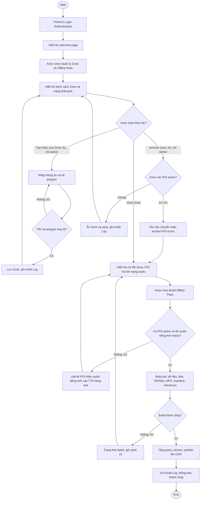

---

# **UC07 — View Tourism Analytics and Heatmap**

**Use Case Diagram (UC07):**

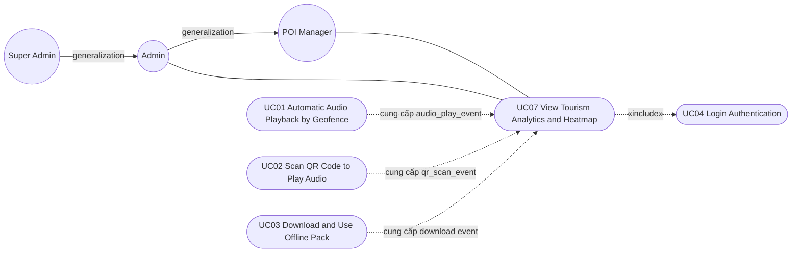

| **Use Case Number:**           | **UC07**                                                                                                                                                                                                                                                                                     |                                                                                                                                                                                                                                                          |
| :----------------------------- | :------------------------------------------------------------------------------------------------------------------------------------------------------------------------------------------------------------------------------------------------------------------------------------------- | :------------------------------------------------------------------------------------------------------------------------------------------------------------------------------------------------------------------------------------------------------- |
| **Use Case Name:**             | View Tourism Analytics and Heatmap                                                                                                                                                                                                                                                           |                                                                                                                                                                                                                                                          |
| **Actor (s):**                 | POI Manager, Admin, Super Admin                                                                                                                                                                                                                                                              |                                                                                                                                                                                                                                                          |
| **Maturity:**                  | Focused                                                                                                                                                                                                                                                                                      |                                                                                                                                                                                                                                                          |
| **Summary:**                   | Actor xem thống kê du lịch trên toàn bộ POI: số lượt nghe, lượt quét QR, số thiết bị ẩn danh, top POI, thời lượng nghe và lượt tải Offline Pack, theo khoảng thời gian và bộ lọc; đồng thời xem heatmap mật độ lượt nghe được tạo từ event phát audio. POI Manager được xem toàn bộ dữ liệu. |                                                                                                                                                                                                                                                          |
| **Basic Course of Events:**    | **Actor Action**                                                                                                                                                                                                                                                                             | **System Response**                                                                                                                                                                                                                                      |
|                                | 1\. Perform **{Login Authentication}**                                                                                                                                                                                                                                                       |                                                                                                                                                                                                                                                          |
|                                |                                                                                                                                                                                                                                                                                              | 2\. System displays welcome page with main features for actor to choose from.                                                                                                                                                                            |
|                                | 3\. Actor chọn “Analytics”.                                                                                                                                                                                                                                                                  |                                                                                                                                                                                                                                                          |
|                                |                                                                                                                                                                                                                                                                                              | 4\. Hệ thống hiển thị mặc định dữ liệu **7 ngày gần nhất**: thẻ KPI (tổng lượt nghe, lượt quét QR, số thiết bị ẩn danh, tổng và trung bình thời lượng nghe, lượt tải Offline Pack), biểu đồ theo ngày, bảng Top 10 POI, kèm “Cập nhật lúc hh:mm”. **E1** |
|                                | 5\. Actor chọn khoảng thời gian: Hôm nay, 7 ngày, 30 ngày hoặc Tùy chọn. **A1**                                                                                                                                                                                                              |                                                                                                                                                                                                                                                          |
|                                | 6\. Actor chọn bộ lọc theo Zone, POI, ngôn ngữ, loại trigger (`geofence`, `qr`).                                                                                                                                                                                                             |                                                                                                                                                                                                                                                          |
|                                |                                                                                                                                                                                                                                                                                              | 7\. Hệ thống truy vấn dữ liệu tổng hợp và cập nhật KPI, biểu đồ, Top POI kèm so sánh với kỳ liền trước. **E2**                                                                                                                                           |
|                                | 8\. Actor mở tab “Heatmap”.                                                                                                                                                                                                                                                                  |                                                                                                                                                                                                                                                          |
|                                |                                                                                                                                                                                                                                                                                              | 9\. Hệ thống hiển thị heatmap trên bản đồ: mỗi điểm là tọa độ POI, trọng số là số lượt nghe trong khoảng thời gian và bộ lọc đang chọn; dữ liệu cập nhật theo chu kỳ 15 phút (BR-26). **E3**                                                             |
|                                | 10\. Actor chọn một điểm trên heatmap. **A2**                                                                                                                                                                                                                                                |                                                                                                                                                                                                                                                          |
|                                |                                                                                                                                                                                                                                                                                              | 11\. Hệ thống hiển thị chi tiết POI: lượt nghe, lượt quét QR, thời lượng nghe trung bình, phân bố ngôn ngữ. The use case ends.                                                                                                                           |
|                                |                                                                                                                                                                                                                                                                                              |                                                                                                                                                                                                                                                          |
| **Alternative Paths:**         | **A1.** Actor chọn khoảng thời gian tùy chọn.                                                                                                                                                                                                                                                |                                                                                                                                                                                                                                                          |
|                                | **Actor Action**                                                                                                                                                                                                                                                                             | **System Response**                                                                                                                                                                                                                                      |
|                                | 1\. Actor chọn ngày bắt đầu và ngày kết thúc.                                                                                                                                                                                                                                                |                                                                                                                                                                                                                                                          |
|                                |                                                                                                                                                                                                                                                                                              | 2\. Hệ thống kiểm tra khoảng thời gian hợp lệ và nằm trong thời hạn lưu trữ dữ liệu. **E2**                                                                                                                                                              |
|                                |                                                                                                                                                                                                                                                                                              | Return to step 7 of the Basic Course of Events.                                                                                                                                                                                                          |
|                                | **A2.** Actor xem Top POI từ bảng thay vì heatmap.                                                                                                                                                                                                                                           |                                                                                                                                                                                                                                                          |
|                                | **Actor Action**                                                                                                                                                                                                                                                                             | **System Response**                                                                                                                                                                                                                                      |
|                                | 1\. Actor chọn một POI trong bảng Top 10 POI.                                                                                                                                                                                                                                                |                                                                                                                                                                                                                                                          |
|                                |                                                                                                                                                                                                                                                                                              | Return to step 11 of the Basic Course of Events.                                                                                                                                                                                                         |
| **Exception Paths:**           | **E1.** Không có dữ liệu trong khoảng thời gian/bộ lọc đã chọn. Hệ thống hiển thị trạng thái “Chưa có dữ liệu” thay vì biểu đồ rỗng. Return to step 5 of the Basic Course of Events.                                                                                                         |                                                                                                                                                                                                                                                          |
|                                | **E2.** Ngày bắt đầu lớn hơn ngày kết thúc, ngày ở tương lai, hoặc khoảng thời gian vượt thời hạn lưu trữ. Hệ thống thông báo lỗi và yêu cầu chọn lại. Return to step 5 of the Basic Course of Events.                                                                                       |                                                                                                                                                                                                                                                          |
|                                | **E3.** Không tải được bản đồ hoặc truy vấn heatmap quá thời gian. Hệ thống hiển thị lỗi và nút “Thử lại”; các tab KPI vẫn dùng được. Return to step 8 of the Basic Course of Events.                                                                                                        |                                                                                                                                                                                                                                                          |
| **Extension Points:**          | None                                                                                                                                                                                                                                                                                         |                                                                                                                                                                                                                                                          |
| **Triggers:**                  | Actor muốn theo dõi hiệu quả thuyết minh và mật độ tham quan.                                                                                                                                                                                                                                |                                                                                                                                                                                                                                                          |
| **Assumptions:**               | Event từ Mobile App (kể cả event offline đồng bộ muộn) được Backend tổng hợp định kỳ; event đồng bộ muộn được cộng vào đúng ngày phát sinh.                                                                                                                                                  |                                                                                                                                                                                                                                                          |
| **Preconditions:**             | Actor đã đăng nhập với role POI Manager, Admin hoặc Super Admin.                                                                                                                                                                                                                             |                                                                                                                                                                                                                                                          |
| **Post Conditions:**           | Actor xem được KPI, biểu đồ, Top POI và heatmap theo khoảng thời gian và bộ lọc đã chọn. Use case không thay đổi dữ liệu.                                                                                                                                                                    |                                                                                                                                                                                                                                                          |
| **Reference: Business Rules:** | BR-23, BR-24, BR-25, BR-26, BR-27                                                                                                                                                                                                                                                            |                                                                                                                                                                                                                                                          |
| **Reference: Risks:**          | R-09                                                                                                                                                                                                                                                                                         |                                                                                                                                                                                                                                                          |
| **Author(s):**                 | Khang Pham                                                                                                                                                                                                                                                                                   |                                                                                                                                                                                                                                                          |
| **Date:**                      | 29-09-2026                                                                                                                                                                                                                                                                                   |                                                                                                                                                                                                                                                          |
| **Activity Diagram:**          | Xem sơ đồ bên dưới.                                                                                                                                                                                                                                                                          |                                                                                                                                                                                                                                                          |

**Activity Diagram (UC07):**

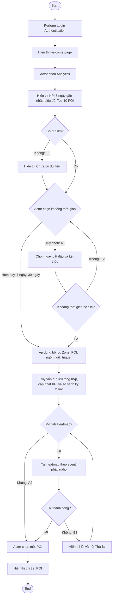

---

# **UC08 — Manage Dashboard Accounts**

**Use Case Diagram (UC08):**

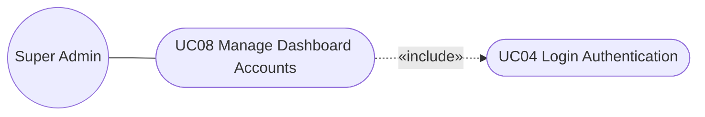

| **Use Case Number:**           | **UC08**                                                                                                                                                                                                                                   |                                                                                                                                                    |
| :----------------------------- | :----------------------------------------------------------------------------------------------------------------------------------------------------------------------------------------------------------------------------------------- | :------------------------------------------------------------------------------------------------------------------------------------------------- |
| **Use Case Name:**             | Manage Dashboard Accounts                                                                                                                                                                                                                  |                                                                                                                                                    |
| **Actor (s):**                 | Super Admin                                                                                                                                                                                                                                |                                                                                                                                                    |
| **Maturity:**                  | Focused                                                                                                                                                                                                                                    |                                                                                                                                                    |
| **Summary:**                   | Super Admin tạo tài khoản Dashboard, gán role (POI Manager, Admin, Super Admin), khóa/mở khóa tài khoản và gửi yêu cầu đặt lại mật khẩu. Du khách không có tài khoản nên không thuộc phạm vi use case này.                                 |                                                                                                                                                    |
| **Basic Course of Events:**    | **Actor Action**                                                                                                                                                                                                                           | **System Response**                                                                                                                                |
|                                | 1\. Perform **{Login Authentication}**                                                                                                                                                                                                     |                                                                                                                                                    |
|                                |                                                                                                                                                                                                                                            | 2\. System displays welcome page with main features for actor to choose from.                                                                      |
|                                | 3\. Super Admin chọn “Quản lý tài khoản”.                                                                                                                                                                                                  |                                                                                                                                                    |
|                                |                                                                                                                                                                                                                                            | 4\. Hệ thống hiển thị danh sách tài khoản: họ tên, email, role, trạng thái (`active`, `locked`, `disabled`), lần đăng nhập gần nhất.               |
|                                | 5\. Super Admin chọn “Tạo tài khoản”. **A1, A2, A3**                                                                                                                                                                                       |                                                                                                                                                    |
|                                |                                                                                                                                                                                                                                            | 6\. Hệ thống hiển thị form: họ tên, email, role.                                                                                                   |
|                                | 7\. Super Admin nhập thông tin và chọn “Lưu”.                                                                                                                                                                                              |                                                                                                                                                    |
|                                |                                                                                                                                                                                                                                            | 8\. Hệ thống kiểm tra định dạng email và email chưa tồn tại. **E1**                                                                                |
|                                |                                                                                                                                                                                                                                            | 9\. Hệ thống tạo tài khoản `active` và gửi email chứa liên kết thiết lập mật khẩu lần đầu (thời hạn theo cấu hình). **E2**                         |
|                                |                                                                                                                                                                                                                                            | 10\. Hệ thống ghi Audit Log và thông báo tạo thành công. The use case ends.                                                                        |
|                                |                                                                                                                                                                                                                                            |                                                                                                                                                    |
| **Alternative Paths:**         | **A1.** Thay đổi role của tài khoản.                                                                                                                                                                                                       |                                                                                                                                                    |
|                                | **Actor Action**                                                                                                                                                                                                                           | **System Response**                                                                                                                                |
|                                | 1\. Super Admin chọn một tài khoản và chọn role mới.                                                                                                                                                                                       |                                                                                                                                                    |
|                                |                                                                                                                                                                                                                                            | 2\. Hệ thống kiểm tra ràng buộc Super Admin cuối cùng. **E3**                                                                                      |
|                                |                                                                                                                                                                                                                                            | 3\. Hệ thống cập nhật role, hủy các Session hiện tại của tài khoản để quyền mới có hiệu lực ngay. Return to step 10 of the Basic Course of Events. |
|                                | **A2.** Khóa, mở khóa hoặc vô hiệu hóa tài khoản.                                                                                                                                                                                          |                                                                                                                                                    |
|                                | **Actor Action**                                                                                                                                                                                                                           | **System Response**                                                                                                                                |
|                                | 1\. Super Admin chọn “Khóa”, “Mở khóa” hoặc “Vô hiệu hóa”.                                                                                                                                                                                 |                                                                                                                                                    |
|                                |                                                                                                                                                                                                                                            | 2\. Hệ thống kiểm tra ràng buộc Super Admin cuối cùng. **E3**                                                                                      |
|                                |                                                                                                                                                                                                                                            | 3\. Hệ thống cập nhật trạng thái; nếu khóa/vô hiệu hóa, hệ thống hủy mọi Session của tài khoản. Return to step 10 of the Basic Course of Events.   |
|                                | **A3.** Gửi yêu cầu đặt lại mật khẩu.                                                                                                                                                                                                      |                                                                                                                                                    |
|                                | **Actor Action**                                                                                                                                                                                                                           | **System Response**                                                                                                                                |
|                                | 1\. Super Admin chọn “Gửi link đặt lại mật khẩu”.                                                                                                                                                                                          |                                                                                                                                                    |
|                                |                                                                                                                                                                                                                                            | 2\. Hệ thống gửi liên kết đặt lại mật khẩu đến email của tài khoản. **E2** Return to step 10 of the Basic Course of Events.                        |
| **Exception Paths:**           | **E1.** Email sai định dạng hoặc đã tồn tại. Hệ thống đánh dấu lỗi. Return to step 7 of the Basic Course of Events.                                                                                                                        |                                                                                                                                                    |
|                                | **E2.** Gửi email thất bại. Hệ thống vẫn lưu thao tác, hiển thị cảnh báo và cho phép gửi lại. Return to step 4 of the Basic Course of Events.                                                                                              |                                                                                                                                                    |
|                                | **E3.** Thao tác sẽ làm hệ thống không còn Super Admin nào đang hoạt động (ví dụ hạ role hoặc khóa Super Admin cuối cùng, hoặc Super Admin tự khóa chính mình). Hệ thống từ chối thao tác. Return to step 4 of the Basic Course of Events. |                                                                                                                                                    |
| **Extension Points:**          | None                                                                                                                                                                                                                                       |                                                                                                                                                    |
| **Triggers:**                  | Có nhân sự mới cần truy cập Dashboard; cần thay đổi quyền hoặc khóa tài khoản.                                                                                                                                                             |                                                                                                                                                    |
| **Assumptions:**               | Quyền được gán theo role cố định (RBAC), chưa cần phân quyền chi tiết theo từng permission ở MVP.                                                                                                                                          |                                                                                                                                                    |
| **Preconditions:**             | Super Admin đã đăng nhập và xác thực MFA thành công.                                                                                                                                                                                       |                                                                                                                                                    |
| **Post Conditions:**           | Tài khoản được tạo hoặc cập nhật; quyền mới có hiệu lực ngay; Audit Log được ghi.                                                                                                                                                          |                                                                                                                                                    |
| **Reference: Business Rules:** | BR-18, BR-19, BR-20                                                                                                                                                                                                                        |                                                                                                                                                    |
| **Reference: Risks:**          | R-06                                                                                                                                                                                                                                       |                                                                                                                                                    |
| **Author(s):**                 | Khang Pham                                                                                                                                                                                                                                 |                                                                                                                                                    |
| **Date:**                      | 29-09-2026                                                                                                                                                                                                                                 |                                                                                                                                                    |
| **Activity Diagram:**          | Xem sơ đồ bên dưới.                                                                                                                                                                                                                        |                                                                                                                                                    |

**Activity Diagram (UC08):**

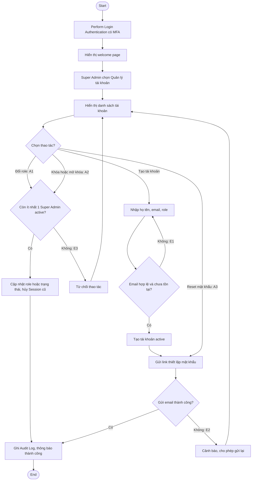

---

# **Business Rules**

| Mã        | Business Rule                                                                                                                                                                                                                                                                                             |
| --------- | --------------------------------------------------------------------------------------------------------------------------------------------------------------------------------------------------------------------------------------------------------------------------------------------------------- |
| **BR-01** | Ở lần mở ứng dụng đầu tiên, du khách chọn ngôn ngữ thuyết minh; ngôn ngữ mặc định là English. Du khách có thể đổi ngôn ngữ bất cứ lúc nào trong Settings.                                                                                                                                                 |
| **BR-02** | Bán kính geofence mặc định là 30 m và áp dụng cho tất cả POI. Chỉ Admin (và Super Admin) có thể thay đổi giá trị này (đề xuất khoảng 10 m – 200 m).                                                                                                                                                       |
| **BR-03** | Geofence entry/exit event chỉ được xử lý khi vị trí ổn định ít nhất 3 giây (debounce) và độ chính xác GPS đạt ngưỡng cấu hình.                                                                                                                                                                            |
| **BR-04** | Du khách có thể tắt hoàn toàn Auto-play. Khi tắt, hệ thống không phát audio tự động theo geofence.                                                                                                                                                                                                        |
| **BR-05** | Cooldown 5 phút cho cùng `anonymous_device_id` và `poi_id` chỉ áp dụng cho trigger `geofence`. Trigger `qr` và thao tác thủ công (Replay) bỏ qua cooldown.                                                                                                                                                |
| **BR-06** | Khi nhiều geofence chồng lấp: chọn POI có tâm gần thiết bị nhất; nếu chênh lệch khoảng cách nhỏ hơn 5 m thì chọn POI có `priority` cao hơn; nếu vẫn bằng nhau thì chọn `poi_id` nhỏ hơn. Các POI còn lại hiển thị trong banner “Gần đây còn có”.                                                          |
| **BR-07** | Mỗi thời điểm chỉ phát một audio.                                                                                                                                                                                                                                                                         |
| **BR-08** | Audio đang phát tự dừng (fade-out) khi du khách rời POI (exit event đã debounce), hoặc khi du khách ở trong POI khác liên tục đủ dwell time (đề xuất 10 giây, cấu hình được). Quét QR dừng audio cũ ngay lập tức.                                                                                         |
| **BR-09** | Thứ tự chọn nguồn audio: audio trong Offline Pack/local → audio cloud đã cache → tạo audio mới bằng Cloud TTS (cần mạng) → audio mặc định (audio tiếng Anh của POI).                                                                                                                                      |
| **BR-10** | Audio mặc định là giọng đọc tiếng Anh tương ứng với nội dung của chính POI đó. Mỗi POI bắt buộc có nội dung tiếng Anh; nếu POI Manager/Admin không upload MP3 tiếng Anh, hệ thống tự tạo bằng TTS khi lưu POI. Audio tiếng Anh luôn có trong Offline Pack.                                                |
| **BR-11** | Mã QR chứa URL `https://{app-domain}/q/{qr_code}`; `qr_code` là mã ngắn ngẫu nhiên, duy nhất, không đổi trong suốt vòng đời POI, không dùng ID nội bộ của database. Mobile App tra `qr_code` trong dữ liệu local trước, rồi mới gọi API. Chưa dùng Dynamic Signed QR ở MVP.                               |
| **BR-12** | Offline Pack do POI Manager hoặc Admin build theo từng Zone, gồm: dữ liệu POI, nội dung đa ngôn ngữ, ảnh, PMTiles và toàn bộ MP3, kèm manifest và checksum.                                                                                                                                               |
| **BR-13** | Du khách chỉ tải Offline Pack thủ công và chỉ qua Wi-Fi.                                                                                                                                                                                                                                                  |
| **BR-14** | Khi Zone có `pack_version` mới, Mobile App tự động cập nhật ở chế độ nền khi có Wi-Fi; bản cũ chỉ được thay khi bản mới cài đặt thành công.                                                                                                                                                               |
| **BR-15** | Du khách có thể xóa Offline Pack đã tải; event chưa đồng bộ không bị xóa theo.                                                                                                                                                                                                                            |
| **BR-16** | Đăng nhập sai 5 lần liên tiếp thì tài khoản bị khóa 15 phút (giá trị cấu hình được).                                                                                                                                                                                                                      |
| **BR-17** | Mật khẩu tối thiểu 8 ký tự, gồm chữ và số; liên kết đặt lại mật khẩu dùng một lần và có thời hạn (đề xuất 30 phút).                                                                                                                                                                                       |
| **BR-18** | Super Admin bắt buộc MFA bằng OTP 6 chữ số gửi qua email, hết hạn sau 5 phút, tối đa 3 lần nhập sai.                                                                                                                                                                                                      |
| **BR-19** | Mọi thao tác tạo, sửa, archive, khôi phục, build pack, thay đổi cấu hình, tài khoản và đăng nhập đều được ghi Audit Log.                                                                                                                                                                                  |
| **BR-20** | Phân quyền theo role: POI Manager chỉ có quyền liên quan đến POI (quản lý POI, build Offline Pack, xem Analytics); Admin có quyền của POI Manager, cộng thêm quản lý Zone và cấu hình hệ thống; Super Admin có quyền của Admin và quản lý tài khoản. Access/refresh token hết hạn theo cấu hình hệ thống. |
| **BR-21** | POI không qua quy trình kiểm duyệt: chỉ có trạng thái `active` và `archived`; thay đổi có hiệu lực ngay; không xóa vĩnh viễn (chỉ archive); audio là một phần của POI và được quản lý chung với POI.                                                                                                      |
| **BR-22** | Mỗi lần lưu POI tăng `content_version` và lưu snapshot phiên bản cũ để truy vết và khôi phục.                                                                                                                                                                                                             |
| **BR-23** | Du khách không cần tài khoản; chỉ định danh bằng `anonymous_device_id` ngẫu nhiên, không thu thập thông tin cá nhân.                                                                                                                                                                                      |
| **BR-24** | Event phát sinh khi offline được lưu local queue và đồng bộ khi có mạng; Backend ghi nhận theo thời điểm phát sinh event.                                                                                                                                                                                 |
| **BR-25** | Chỉ số MVP: số lượt nghe, lượt quét QR, số thiết bị ẩn danh, Top POI, thời lượng nghe, lượt tải Offline Pack. Khoảng thời gian: Hôm nay, 7 ngày (mặc định), 30 ngày, Tùy chọn.                                                                                                                            |
| **BR-26** | Heatmap được tạo từ `audio_play_event`, dùng tọa độ POI (không dùng vị trí thực của thiết bị), cập nhật định kỳ 15 phút; KPI cập nhật định kỳ 5 phút.                                                                                                                                                     |
| **BR-27** | POI Manager, Admin và Super Admin đều xem được Analytics của toàn bộ POI. Thời hạn lưu dữ liệu Analytics **chưa được chốt** (xem R-09).                                                                                                                                                                   |
| **BR-28** | Thao tác chạm vào POI trên bản đồ để nghe thủ công chưa được tách thành use case riêng ở phiên bản này; nếu bổ sung sau, thao tác này cũng bỏ qua cooldown như BR-05.                                                                                                                                     |

---

# **Risks**

| Mã       | Rủi ro                                                                                       | Ảnh hưởng                                                   | Hướng giảm thiểu                                                                                               |
| -------- | -------------------------------------------------------------------------------------------- | ----------------------------------------------------------- | -------------------------------------------------------------------------------------------------------------- |
| **R-01** | Hệ điều hành giới hạn số vùng geofence và hạn chế chạy nền.                                  | Không phát được audio cho một số POI.                       | Chỉ đăng ký geofence cho Hotset (POI gần nhất), cập nhật Hotset khi di chuyển.                                 |
| **R-02** | Sai số GPS lớn ở khu vực nhà cao tầng.                                                       | Phát nhầm POI hoặc phát trễ.                                | Debounce 3 giây, ngưỡng accuracy, quy tắc chồng lấp BR-06, QR làm phương án thay thế.                          |
| **R-03** | Tạo audio Cloud TTS tại chỗ bị chậm hoặc tốn chi phí.                                        | Du khách chờ lâu.                                           | Cache audio vừa tạo, timeout ngắn, fallback audio tiếng Anh của POI, tạo audio hàng loạt trước khi build pack. |
| **R-04** | Offline Pack có dung lượng lớn (PMTiles, MP3, ảnh).                                          | Du khách ngại tải, thiếu dung lượng.                        | Nén ảnh, bitrate MP3 phù hợp, hiển thị dung lượng trước khi tải, cập nhật theo phần thay đổi.                  |
| **R-05** | POI Manager sửa nội dung không qua kiểm duyệt.                                               | Nội dung sai được công khai ngay.                           | Audit Log, snapshot phiên bản, Admin có quyền can thiệp và khôi phục.                                          |
| **R-06** | Tấn công dò mật khẩu Dashboard.                                                              | Lộ quyền quản trị.                                          | Giới hạn số lần sai, khóa tạm thời, MFA cho Super Admin, thông báo lỗi chung.                                  |
| **R-07** | Tiêu hao pin do theo dõi vị trí nền.                                                         | Du khách tắt ứng dụng.                                      | Dùng geofence của hệ điều hành thay vì GPS liên tục; cho phép tắt Auto-play.                                   |
| **R-08** | QR bị dán đè hoặc làm giả (không dùng signed QR ở MVP).                                      | Du khách bị dẫn đến nội dung sai.                           | Chỉ chấp nhận domain của hệ thống; cân nhắc Dynamic Signed QR ở phiên bản sau.                                 |
| **R-09** | Chưa chốt thời hạn lưu dữ liệu Analytics.                                                    | Rủi ro tuân thủ quy định bảo vệ dữ liệu và chi phí lưu trữ. | Chỉ lưu dữ liệu ẩn danh; chốt thời hạn lưu trước khi triển khai thật.                                          |
| **R-10** | Ranh giới hành chính thay đổi (TP.HCM đã sắp xếp lại đơn vị hành chính cấp xã từ 01/7/2025). | Zone theo “quận” không còn khớp ranh giới chính thức.       | Zone dùng polygon tự vẽ, độc lập với ranh giới hành chính (xem UC06).                                          |

---

# **Quy ước ký hiệu**

| Ký hiệu                                 | Ý nghĩa                                                                                                             |
| --------------------------------------- | ------------------------------------------------------------------------------------------------------------------- |
| `Summary`                               | **General** — mục tiêu và giá trị của use case.                                                                     |
| `Basic Course of Events`                | **Specific** — luồng chính theo Actor Action / System Response.                                                     |
| `Use Case Diagram` + `Activity Diagram` | **Diagram** — mỗi UC có một Use Case Diagram và một Activity Diagram riêng.                                         |
| **A#**                                  | Alternative Path, gắn ngay tại bước rẽ nhánh trong Basic Course of Events.                                          |
| **E#**                                  | Exception Path, gắn ngay tại bước có thể xảy ra lỗi.                                                                |
| **{Tên}**                               | Tham chiếu đến một Use Case khác trong tài liệu, hoặc một Extension Point được mô tả trong trường Extension Points. |
